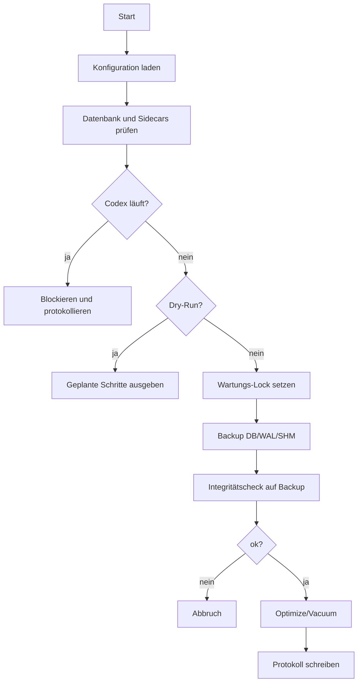
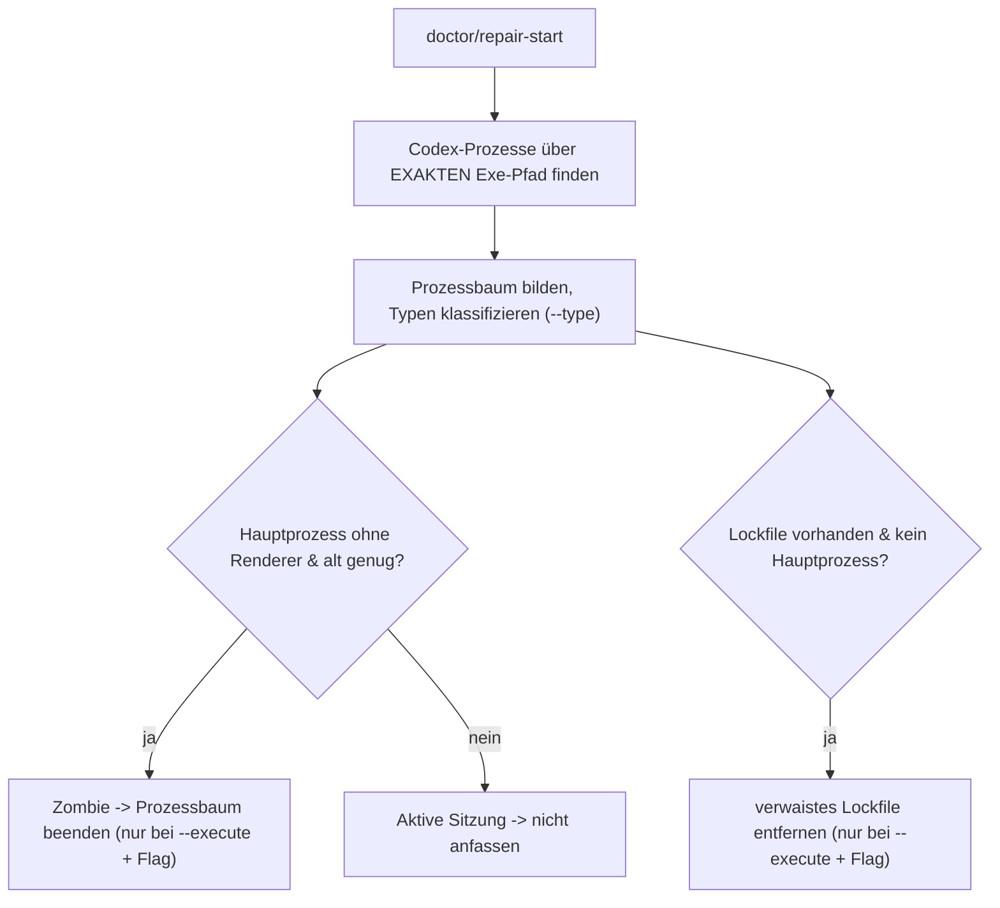
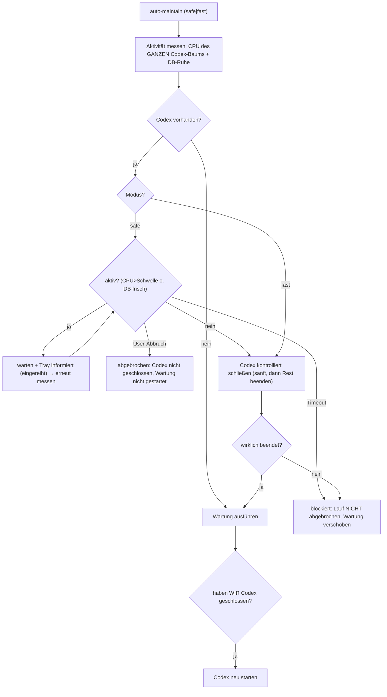

# ARCHITECTURE

## Zweck

CareCenter for Codex trennt den sicheren Wartungskern von UI und CLI. Dadurch
kann die Logik getestet werden, ohne die Tray-App zu starten (der interne Python-Paketname
`codex_logdatenbank_wartung` ist historisch und bleibt unveraendert).

## Module

| Modul | Aufgabe |
|---|---|
| `config.py` | lokale Konfiguration, Standardpfade (aus `%LOCALAPPDATA%`/`%APPDATA%`/`~/.codex`), Schwellwerte |
| `i18n.py` | leichtgewichtige DE-/EN-Lokalisierung und persistierte Sprachauswahl |
| `processes.py` | Codex-Prozessprüfung über PowerShell/CIM; Klassifikation (`--type`), exaktes Exe-Matching, Prozessbaum und fail-closed Erkennung wiederholter Runtime-MCP-Launcher |
| `maintenance.py` | Backup + Retention, Integritätscheck, WAL-Checkpoint, `PRAGMA optimize`, `VACUUM`, Protokolle |
| `health.py` | Startup-Diagnose (`diagnose`) und gezielte Reparatur (`repair_start`) — getrennt vom Wartungsblocker |
| `orchestrator.py` | Autonome Wartung (`auto_maintain`): Aktivitätsmessung (CPU+DB des ganzen Baums), zwei Modi (safe/fast) |
| `automation_control.py` | aktive Codex-Automatisierungen pausieren, CareCenter-eigene Pausen nachhalten und gezielt reaktivieren |
| `watchdog.py` | Hintergrund-Wächter: reapt bei geschlossenem Codex idle Ghosts und bei aktivem Desktop sicher wiederholte, CPU-inaktive Runtime-MCP-Prozessbäume |
| `start_repair.py` | Klassifikation der Start-Lage für die zusammengefasste „Codex reparieren"-Eskalation |
| `repair_workflow.py` | Hang-sichere S1–S7-Eskalationsengine (rein, injizierbare Bausteine) |
| `repair_live.py` | Echte Windows-/AppX-Implementierungen der Reparatur-Bausteine (P11 absent-Erkennung, Reinstall-Prävention) |
| `store_repair.py` | Microsoft-Store-Reparatur (wsreset/register/reset) + Store-Produktseite öffnen |
| `store_release.py` | Store-Materialien, öffentliche URLs, Pages-Artefakt und EXE-Pfad validieren |
| `store_screenshot.py` | reproduzierbaren README-/Store-Screenshot aus dem echten Statusfenster rendern |
| `scheduler.py` | Optionaler Windows-Task-Scheduler-Helfer für periodische Aufrufe von `maintain --execute` |
| `thread_hygiene.py` | Altersbasierte Thread-Pflege: Ungelesen-State, transactionales Archivieren und Backups bei geschlossenem Codex |
| `mark_runs_read.py` | Codex-Ungelesen-State für Automations-/Thread-Ergebnisse gesichert als gelesen markieren |
| `config_audit.py` | Audit plus getrennte off/notify/auto-Fixes für MCP-Konfigurationsduplikate, Plattform-Plugins und leere Threads; manueller Audit startet zusätzlich den Runtime-MCP-Reaper |
| `safe_start_integration.py` | Safe-Start-Status, Installation, Start-Gate, Wiederherstellung und Aufschublogik anbinden |
| `single_instance.py` | Windows-Mutex für die Tray-App |
| `tray.py` | PySide6-Systemtray-App mit Statusfenster, QThread-Workern, Wächter, Reparatur, Wartung und Store-Aktionen |
| `tray_app.py` | direkter EXE-/PyInstaller-Einstieg für die Systemtray-App |
| `runtime/app_logging.py` | rotierendes Datei-Logging und Crash-Hooks für fensterlose `pythonw`-/EXE-Starts |
| `cli.py` | maschinenlesbare Bedienung für LLMs und Shell |
| `main.py` | kompatibler Moduleinstieg, der an die CLI weiterleitet |

## Zwei getrennte Pfade

- **Wartung (`maintenance.py`)** ist bewusst „dumm & sicher": Sobald irgendein Codex-Prozess läuft,
  wird die DB-Wartung blockiert (keine `VACUUM`/Schreiboperation auf möglicherweise aktiver DB).
- **Startup-Reparatur (`health.py`)** adressiert das Startproblem getrennt davon: Sie erkennt
  Zombie-Hauptprozesse (kein Renderer im Baum) und verwaiste Lockfiles und beendet/entfernt nur diese.
  Reihenfolge im Problemfall: `repair-start` → keine Codex-Prozesse mehr → `maintain` läuft unblockiert.
- **Auto-Trigger (`scheduler.py`)** bleibt separat: Er ruft lediglich den bestehenden sicheren
  Wartungspfad periodisch auf, ohne den konservativen Blocker aufzuweichen.

## Wartungsablauf

## Startup-Reparaturablauf

## Autonome Wartung (auto-maintain, zwei Modi)

Empirie (2026-05-29): Aktive Automatisierung erzeugt 25–500 % CPU eines Kerns (auch in Worker-Kindern
wie `python run.py`), Leerlauf-Rest <2 %. Das Schließen von Codex **bricht laufende Läufe ab** —
deshalb handelt der Safe-Modus erst bei echtem Leerlauf und unterbricht nie einen Lauf.
Der manuelle Safe-Abbruch beendet nur die Wartephase; er schließt Codex nicht und greift
nicht in bereits laufende Datenbankoperationen ein.

## Sicherheitsmodell

- Codex-Prozesse blockieren die DB-Wartung (`maintain`).
- Backups entstehen vor jeder echten SQLite-Operation; Backup-Anzahl ist begrenzt (`backup_keep`).
- Die Integrität wird auf dem Backup geprüft, nicht nur behauptet.
- Ohne explizite Archivkonfiguration werden keine Logdaten gelöscht.
- Thread-Archivierung ist separat konfiguriert (`auto_archive_threads_days=0` bedeutet aus), läuft nur bei geschlossenem Codex und sichert `state_5.sqlite` vor Änderungen.
- Startup-Reparatur beendet ausschließlich Zombie-Hauptprozesse (kein Renderer); aktive Sitzungen nie.
- Runtime-MCP-Bereinigung gilt nur für direkte Launcher unter dem Store-Desktop-App-Server: der neueste Start-Cohort bleibt immer bestehen, mindestens zwei verschiedene Signaturen müssen exakt wiederholt sein, die Karenzzeit muss abgelaufen sein und der vollständige Kandidatenbaum darf im CPU-Sample nicht arbeiten.
- npm-/CLI-app-server, der Desktop-App-Server selbst, fremde Kindprozesse und Kandidaten mit unvollständigen Zeitdaten werden fail-closed ausgeschlossen.
- Kill-Targeting nur über den exakten konfigurierten Exe-Pfad plus Prozessbaum — keine Substring-Treffer.
