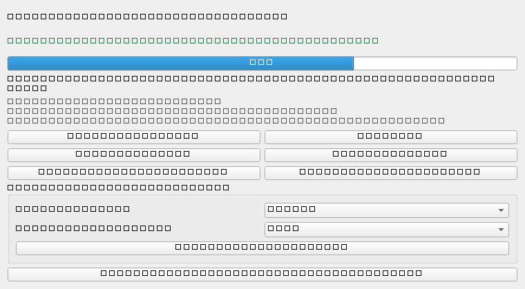

# CareCenter for Codex

> Inoffizielles lokales Windows-Tray- und CLI-Werkzeug, das die OpenAI-Codex-Desktop-App gesund hält — repariert fehlgeschlagene Starts, entfernt hängende Reste und wartet die SQLite-Logdatenbank sicher. Vollständig offline, keine Telemetrie.

[](https://github.com/dev-bricks/CareCenter-for-Codex/actions/workflows/tests.yml)
[](https://www.python.org/)
[](LICENSE)
[](https://github.com/dev-bricks/CareCenter-for-Codex)

Englische Dokumentation: [README.md](README.md)

> [!IMPORTANT]
> Dieses Werkzeug ist ein unabhängiges Community-Projekt. Es wurde nicht von OpenAI erstellt, ist nicht mit OpenAI verbunden und wird nicht von OpenAI unterstützt oder gesponsert. „OpenAI“ und „Codex“ sind Marken von OpenAI und werden hier nur zur Beschreibung der Kompatibilität verwendet.

## Warum

Unter Windows kann nach dem Schließen des Codex-Desktopfensters ein hängender Hauptprozess übrig bleiben. Dieser Restprozess kann den Singleton-Lock der App halten, sodass der nächste Start scheinbar nichts tut. CareCenter entfernt genau diesen ersten Blocker sicher: Es greift nur bei inaktiven Ghost-Prozessen, verwaisten Lockfiles und ausdrücklich gestarteten Wartungspfaden ein.

## Funktionen

- Hintergrund-Wächter: prüft alle 60 Sekunden auf alte Startblocker und doppelte Runtime-MCP-Prozessgenerationen. Die Runtime-Bereinigung arbeitet fail-closed: Sie erfasst nur inaktive Launcher-Bäume, die unter demselben Store-Desktop-App-Server wiederholt wurden, behält immer den neuesten Start-Cohort und berührt weder den App-Server selbst noch die node-basierte Codex-CLI.
- Spracheinstellung im Tray: Im Bereich Einstellungen kann zwischen Deutsch und Englisch gewechselt werden. Die Auswahl wird in `config.json` gespeichert und die sichtbare Tray-Oberfläche wird sofort neu beschriftet.
- Automatisierungssteuerung im Tray: alle aktuell aktiven Codex-Automatisierungen ausschalten, nur von CCC ausgeschaltete Automatisierungen wieder aktivieren oder Automatisierungen sofort beziehungsweise gestaffelt nacheinander einschalten. Der Abstand ist über `automation_stagger_delay_seconds` konfigurierbar (Standard: 60 Sekunden).
- Thread-Postfachpflege: alle als gelesen markieren, ungelesene Threads älter als X Tage markieren und Threads nach einem getrennt einstellbaren Alter automatisch archivieren. Die aktuelle Codex-Datenhaltung (`state_5.sqlite` plus `.codex-global-state.json`) wird nur bei geschlossenem Codex mit Backups, atomarem State-Schreiben und transaktionaler Archivierung geändert.
- Die Audit-Bereinigung besitzt drei getrennte Modi `off` / `notify` / `auto` für doppelte MCP-Konfigurationseinträge, unter Windows unbrauchbare Plugins und leere Threads. Der manuelle Audit startet zusätzlich den konservativen Runtime-MCP-Reaper, auch wenn der Desktop-Renderer läuft; Änderungen an Konfiguration und Threads bleiben bis zum Schließen von Codex aufgeschoben.
- Loop-Modus: 2, 3, 5, 7, 10, 12 oder 24 Stunden wählen. Jeder regulär fällige Zyklus startet mit Fast-Wartung und wiederholt fehlgeschlagene Codex-Beenden-Versuche standardmäßig bis zu dreimal. Wenn das Beenden weiter scheitert, wird Safe zum verlängerten Nachholversuch und der normale Loop-Zähler beginnt neu; wenn Safe vor Ablauf dieses Zählers erfolgreich fertig wird, beginnt der Zähler erneut ab Wartungserfolg plus verifiziertem Codex-Neustart. Läuft der Zähler ab, während Safe noch wartet, wird Safe beendet und der nächste reguläre Fast-Zyklus startet. Automatisierungen werden erst nach erfolgreicher Wartung pausiert und nur diese pausierten Automatisierungen in 60-Sekunden-Fenstern zurückgegeben.
- Direkte Tray-Starts: „Codex safe starten“ startet Safe Start for Codex im eigenen Tray und übernimmt dessen `config.json`; fehlt diese Config, nutzt CareCenter für diesen Start 1 Minute Abstand. Läuft Safe Start bereits, passiert kein zweiter Start. „Codex starten“ startet Codex normal ohne Safe-Start-Gate; ist Safe Start gerade aktiv, gibt CareCenter nur die von Safe Start pausierten Automatisierungen zurück und öffnet kein weiteres Codex-Fenster.
- Ein-Klick-Aktion „Codex reparieren“: startet eine begrenzte Eskalation, die stoppt, sobald Codex wieder startet. Zuerst läuft eine Reparatur ohne Adminrechte; Admin-Neustart, Store-Neuinstallation oder Reboot werden nur bei Bedarf vorgeschlagen.
- Aktuelle Store-Prozesskompatibilität: Erkennt sowohl ältere `Codex.exe`-Electron-Bäume als auch neuere, `ChatGPT.exe` benannte Codex-Store-Bäume samt eingebettetem App-Server, ohne CareCenter selbst mit Codex zu verwechseln.
- Wartung in zwei Modi:
  - Safe wartet, bis der gesamte Codex-Prozessbaum im Leerlauf ist, lässt sich während des Wartens abbrechen, schließt Codex sauber, wartet und startet danach neu.
  - Fast schließt Codex sofort und startet anschließend die Wartung.
- Store-Werkzeuge: reparieren einen hängenden Microsoft-Store-Updatepfad und öffnen bei Bedarf die Store-Seite zur Neuinstallation.
- Konservative Datenbankwartung: Backup inklusive WAL/SHM, Integritätscheck auf dem Backup, WAL-Checkpoint, `PRAGMA optimize`, `VACUUM` und begrenzte Backup-Aufbewahrung.
- Statusfenster mit Fortschrittsbalken, Live-Tray-Tooltip und dauerhaften Audit-Logs.
- Safe Start for Codex wird als Abhängigkeit mitgeliefert und kann im CareCenter-Fenster, aus dem Tray oder per CLI installiert beziehungsweise aktualisiert werden. CareCenter nutzt es für Release-Bursts, Start-Storms und Catch-up-Hinweise.

## Screenshot

Das Tray-Statusfenster zeigt aktuellen Zustand, Zähler für entfernte Reste, Fortschritt, Wartungsaktionen mit Safe-Abbruch, Loop-Modus, Store-Aktionen, Safe-Start-Aktionen, Automatisierungssteuerung und Einstellungen.



Screenshot aus dem echten PySide6-Statusfenster neu erzeugen:

```powershell
$env:PYTHONPATH="src"
python -m codex_logdatenbank_wartung.cli store-screenshot
```

## Voraussetzungen

- Windows 10 oder Windows 11
- Python 3.12+ beim Start aus dem Quellcode
- [PySide6](https://pypi.org/project/PySide6/) für die Tray-Oberfläche

Gebaute EXE-Versionen benötigen keine separate Python-Installation.

## Installation und Start

Aus dem Quellcode:

```powershell
$env:PYTHONPATH="$PWD\src"
pip install -r requirements.txt
python -m codex_logdatenbank_wartung.cli status
python -m codex_logdatenbank_wartung.cli tray
```

Für den normalen Tray-Start aus dem Checkout ist `start.bat` gedacht. Es startet
die App fensterlos über `pythonw.exe` und schreibt Startfehler nach
`%LOCALAPPDATA%\CareCenterForCodex\logs\app.log`. Für Fehlersuche mit sichtbarer
Konsole gibt es `debug.bat`.

Standalone-EXE bauen:

```powershell
build_exe.bat
```

Standardmäßig nutzt der Build die öffentliche Safe-Start-GitHub-Quelle, die in
`pyproject.toml` auf einen exakten Commit festgelegt ist. So bleibt der Build
reproduzierbar, ohne unbemerkt einen dirty lokalen Schwester-Checkout einzubetten.
Eine lokale Safe-Start-Quelle nur bewusst per Override verwenden:

```powershell
$env:CARECENTER_SAFE_START_SOURCE = "C:\Pfad\zu\REL-PUB_safe-start-for-codex"
build_exe.bat
```

## CLI

```powershell
python -m codex_logdatenbank_wartung.cli doctor
python -m codex_logdatenbank_wartung.cli repair --dry-run
python -m codex_logdatenbank_wartung.cli repair --execute
python -m codex_logdatenbank_wartung.cli dry-run
python -m codex_logdatenbank_wartung.cli maintain --execute
python -m codex_logdatenbank_wartung.cli auto-maintain --mode safe --execute
python -m codex_logdatenbank_wartung.cli fast-loop-cycle --execute
python -m codex_logdatenbank_wartung.cli mark-runs-read --dry-run
python -m codex_logdatenbank_wartung.cli mark-runs-read --older-than-days 2
python -m codex_logdatenbank_wartung.cli mark-runs-read --older-than-days 2 --archive-older-than-days 10
python -m codex_logdatenbank_wartung.cli store-repair --level repair --execute
python -m codex_logdatenbank_wartung.cli store-materials
python -m codex_logdatenbank_wartung.cli safe-start-report
python -m codex_logdatenbank_wartung.cli safe-start-install
python -m codex_logdatenbank_wartung.cli schedule install --interval-minutes 180
```

Die CLI liest `language` aus `config.json` für Laufzeitberichte. Der vorgesehene Weg zur dauerhaften Sprachumstellung ist der Einstellungsbereich im Tray.

## Konfiguration

Konfiguration, Logs und Backups liegen standardmäßig außerhalb von Cloud-Sync-Ordnern:

```text
config:   %LOCALAPPDATA%\CareCenterForCodex\config.json
logs:     %LOCALAPPDATA%\CareCenterForCodex\logs\
backups:  %LOCALAPPDATA%\CareCenterForCodex\backups\
database: %USERPROFILE%\.codex\logs_2.sqlite
```

Codex-Pfade werden aus `%LOCALAPPDATA%`, `%APPDATA%` und `CODEX_HOME` erkannt. Neue Installationen legen auch die CareCenter-Daten standardmäßig unter `%LOCALAPPDATA%\CareCenterForCodex` ab. Bestehende lokale Setups unter `C:\_Local_DEV\codex-maintenance\` werden als Legacy-Fallback automatisch weiterverwendet. Alle Pfade lassen sich in `config.json` überschreiben.

Die Runtime-MCP-Bereinigung ist über `reap_runtime_mcp_duplicates` standardmäßig
aktiv. Ihre konservativen Vorgaben sind ein konfigurierbares Mindestalter von 3600 Sekunden
(einer Stunde) für jeden Kandidaten-Root, 90 Sekunden Start-Cohort-Abstand, ein
30-Sekunden-Launcherfenster, mindestens zwei verschiedene
wiederholte MCP-Signaturen und eine Sekunde CPU-Aktivitätsmessung. Alle Schwellen
lassen sich in `config.json` anpassen.

## Sicherheitsmodell

- Konservative Wartung blockiert, solange Codex läuft.
- Geplante Wartung schließt Codex nie.
- Safe Auto-Maintain schließt Codex erst, wenn der gesamte Prozessbaum im Leerlauf ist.
- Der Safe-Abbruch stoppt nur das Warten vor dem Schließen von Codex; laufende Datenbankoperationen werden nicht hart unterbrochen.
- Der Wächter beendet inaktive Ghosts ohne Renderer nur nach der konfigurierten Altersschwelle.
- Die Runtime-MCP-Bereinigung behält immer den neuesten Start-Cohort und überspringt Kandidaten, deren CPU-Zähler noch steigen.
- Der Codex-Desktop-App-Server, fremde Kindprozesse, die Codex-CLI und aktive Desktop-Arbeit sind ausdrücklich ausgeschlossen.
- Destruktive Pfade wie Store-Reset, Admin-Reparatur, Neuinstallation und Reboot sind Vorschläge oder ausdrückliche Nutzeraktionen, keine automatischen Überraschungen.

## Windows-Store-Materialien

Das Projekt enthält die Grundlage für den Windows Store:

- `store_package.json`
- `STORE_LISTING.md`
- `PRIVACY_POLICY.md`
- `SUPPORT.md`
- `docs/privacy.md`
- `docs/support.md`

Öffentliche Store-Seiten:

- Datenschutz: `https://dev-bricks.github.io/CareCenter-for-Codex/privacy`
- Support: `https://dev-bricks.github.io/CareCenter-for-Codex/support`

Validieren mit:

```powershell
python -m codex_logdatenbank_wartung.cli store-materials
python -m codex_logdatenbank_wartung.cli store-materials --live-pages
python -m codex_logdatenbank_wartung.cli store-materials --exe-path C:\_Local_DEV\codex-maintenance\bin
```

Mit `--live-pages` wird das externe Release-Gate geprüft: Der Befehl ruft beide konfigurierten Store-URLs über HTTPS ab und meldet nicht erreichbare Seiten als Warnung. Ohne `--exe-path` versucht der Check, die gebaute EXE automatisch aus `build_exe.bat` (`DIST_DIR`) zu finden. Mit `--exe-path` kann entweder die konkrete `.exe` oder nur der Build-Ordner übergeben werden.

Der Check baut die statischen GitHub-Pages-Dateien außerdem temporär und prüft `privacy/index.html`, `support/index.html`, `index.html` sowie den Build-Marker. Der aktive Workflow `.github/workflows/pages.yml` veröffentlicht die Routen `/privacy/` und `/support/` über GitHub Pages.

## Entwicklung

```powershell
$env:PYTHONPATH="src"
python -m pytest
python -m ruff check src tests
python -m compileall src tests
```

Die Testsuite deckt Wartungssicherheit, Reparatur-Eskalation, Safe-Start-Integration, Automatisierungssteuerung, Store-Materialprüfung, Konfigurationsladen, i18n und persistente Tray-Sprachumschaltung ab.

## Lizenz

CareCenter for Codex steht unter der [MIT-Lizenz](LICENSE). PySide6 wird unter der LGPL verwendet; siehe [THIRD_PARTY_LICENSES.txt](THIRD_PARTY_LICENSES.txt).
