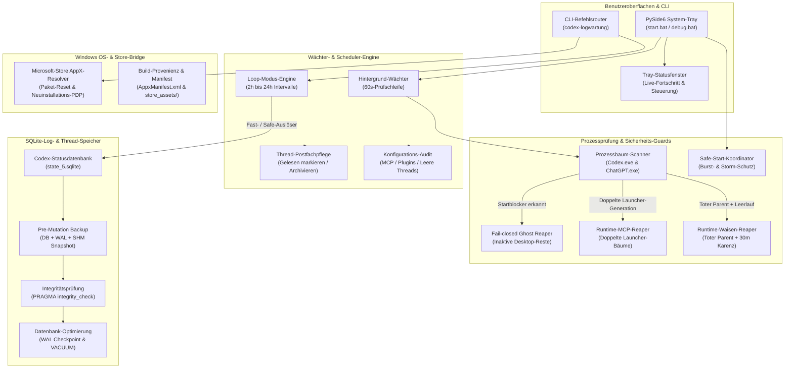
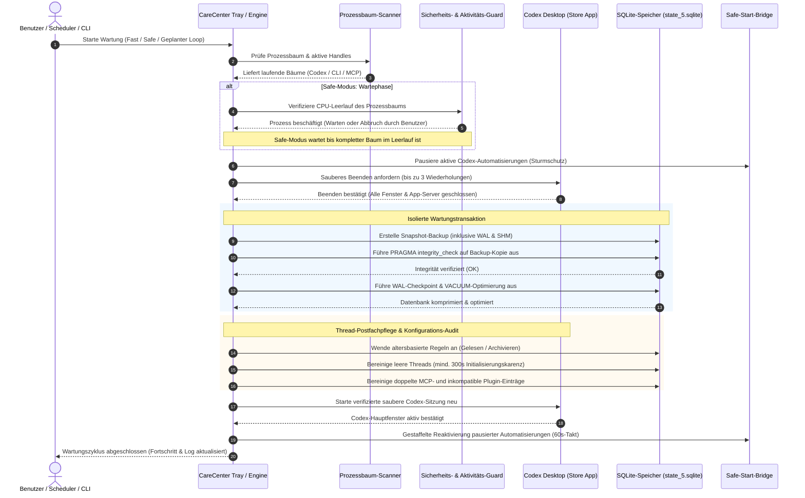
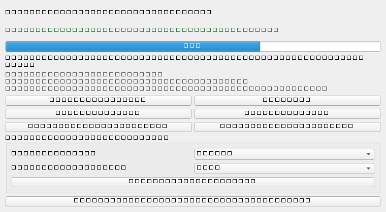

# CareCenter for Codex

> Inoffizielles lokales Windows-Tray- und CLI-Werkzeug, das die OpenAI-Codex-Desktop-App gesund hält — repariert fehlgeschlagene Starts, entfernt hängende Reste und wartet die SQLite-Logdatenbank sicher. Vollständig offline, keine Telemetrie.

[](https://github.com/dev-bricks/CareCenter-for-Codex/actions/workflows/tests.yml)
[](https://github.com/dev-bricks/CareCenter-for-Codex)
[](https://github.com/dev-bricks/CareCenter-for-Codex/releases)
[](https://www.python.org/)
[](https://github.com/dev-bricks/CareCenter-for-Codex)
[](SECURITY.md)
[](SECURITY.md)
[](SECURITY.md)
[](https://github.com/astral-sh/ruff)
[](LICENSE)
[](NOTICE)
[](THIRD_PARTY_LICENSES.md)
[](https://pypi.org/project/PySide6/)
[](https://github.com/dev-bricks)
[](https://github.com/open-bricks)
[](llms.txt)
[](CHANGELOG.md)

[English](README.md) · [Deutsch](README.de.md)

> [!NOTE]
> Maschinenlesbare Architektur, CLI-Befehle und Sicherheitsregeln sind für KI-Agenten in [llms.txt](llms.txt) hinterlegt.

Lokale Audit-Notizen wie `BEFUNDE.md` und temporäre `TASKPLAN*.md`-Statusdateien bleiben bewusst außerhalb von Git und gehören nicht zum öffentlichen Release-Vertrag.

> [!IMPORTANT]
> Dieses Werkzeug ist ein unabhängiges Community-Projekt. Es wurde nicht von OpenAI erstellt, ist nicht mit OpenAI verbunden und wird nicht von OpenAI unterstützt oder gesponsert. „OpenAI“ und „Codex“ sind Marken von OpenAI und werden hier nur zur Beschreibung der Kompatibilität verwendet.

---

### 🧭 Schnellnavigation

- [1. Warum & Problemstellung](#warum--problemstellung)
- [2. Architektur & Systemfluss](#architektur--systemfluss)
- [3. Vollständiger Lebenszyklus-Ablauf](#vollständiger-lebenszyklus-ablauf)
- [4. Kernfähigkeiten & Sicherheitsinvarianten](#kernfähigkeiten--sicherheitsinvarianten)
- [5. Zielgruppen & Auffindbarkeit](#zielgruppen--auffindbarkeit)
- [6. Vergleichsmatrix & Alternativen](#vergleichsmatrix--alternativen)
- [7. Geschwisterwerkzeuge & Partner-Ökosystem](#geschwisterwerkzeuge--partner-ökosystem)
- [8. Funktionen](#funktionen)
- [9. Screenshot](#screenshot)
- [10. Voraussetzungen](#voraussetzungen)
- [11. Installation und Start](#installation-und-start)
- [12. CLI-Befehle](#cli-befehle)
- [13. Konfiguration](#konfiguration)
- [14. Sicherheitsmodell & Invarianten](#sicherheitsmodell--invarianten)
- [15. Windows-Store-Materialien](#windows-store-materialien)
- [16. Drittanbieter-Lizenzen & Transparenz](#drittanbieter-lizenzen--transparenz)
- [17. Entwicklung & Lizenz](#entwicklung--lizenz)
- [18. Gesetzlicher Hinweis (§ 521 BGB) & Haftungsausschluss](#gesetzlicher-hinweis--521-bgb--haftungsausschluss)

---

<a id="sec-01"></a><a id="why--problem-statement"></a><a id="warum--problemstellung"></a>
## Warum & Problemstellung

Unter Windows kann nach dem Schließen des Codex-Desktopfensters ein hängender Hauptprozess übrig bleiben. Dieser Restprozess kann den Singleton-Lock der App halten, sodass der nächste Start scheinbar nichts tut. CareCenter entfernt genau diesen ersten Blocker sicher: Es greift nur bei inaktiven Ghost-Prozessen, verwaisten Lockfiles und ausdrücklich gestarteten Wartungspfaden ein.

<a id="sec-02"></a><a id="architecture--system-flow"></a><a id="architektur--systemfluss"></a>
## Architektur & Systemfluss


```mermaid
flowchart TD
    subgraph UI["Benutzeroberflächen & CLI"]
        TRAY["PySide6 System-Tray\n(start.bat / debug.bat)"]
        WIN["Tray-Statusfenster\n(Live-Fortschritt & Steuerung)"]
        CLI["CLI-Befehlsrouter\n(codex-logwartung)"]
    end

    subgraph DAEMON["Wächter- & Scheduler-Engine"]
        WATCH["Hintergrund-Wächter\n(60s-Prüfschleife)"]
        SCHED["Loop-Modus-Engine\n(2h bis 24h Intervalle)"]
        TH_HYG["Thread-Postfachpflege\n(Gelesen markieren / Archivieren)"]
        CFG_AUD["Konfigurations-Audit\n(MCP / Plugins / Leere Threads)"]
    end

    subgraph GUARDS["Prozessprüfung & Sicherheits-Guards"]
        SCAN["Prozessbaum-Scanner\n(Codex.exe & ChatGPT.exe)"]
        GHOST["Fail-closed Ghost Reaper\n(Inaktive Desktop-Reste)"]
        MCP_REAP["Runtime-MCP-Reaper\n(Doppelte Launcher-Bäume)"]
        ORPHAN["Runtime-Waisen-Reaper\n(Toter Parent + 30m Karenz)"]
        SAFE_START["Safe-Start-Koordinator\n(Burst- & Storm-Schutz)"]
    end

    subgraph STORAGE["SQLite-Log- & Thread-Speicher"]
        DB["Codex-Statusdatenbank\n(state_5.sqlite)"]
        BAK["Pre-Mutation Backup\n(DB + WAL + SHM Snapshot)"]
        CHECK["Integritätsprüfung\n(PRAGMA integrity_check)"]
        VAC["Datenbank-Optimierung\n(WAL Checkpoint & VACUUM)"]
    end

    subgraph STORE_OS["Windows OS- & Store-Bridge"]
        APPX["Microsoft-Store AppX-Resolver\n(Paket-Reset & Neuinstallations-PDP)"]
        PROV["Build-Provenienz & Manifest\n(AppxManifest.xml & store_assets/)"]
    end

    TRAY --> WATCH
    TRAY --> WIN
    CLI --> SCHED
    WATCH --> SCAN
    SCAN -->|Startblocker erkannt| GHOST
    SCAN -->|Doppelte Launcher-Generation| MCP_REAP
    SCAN -->|Toter Parent + Leerlauf| ORPHAN
    SCHED -->|Fast- / Safe-Auslöser| DB
    DB --> BAK --> CHECK --> VAC
    DAEMON --> TH_HYG
    DAEMON --> CFG_AUD
    TRAY --> SAFE_START
    CLI --> APPX
```

<a id="sec-03"></a><a id="complete-lifecycle-sequence"></a><a id="vollstaendiger-lebenszyklus-ablauf"></a><a id="vollständiger-lebenszyklus-ablauf"></a>
## Vollständiger Lebenszyklus-Ablauf


```mermaid
sequenceDiagram
    autonumber
    actor User as Benutzer / Scheduler / CLI
    participant Tray as CareCenter Tray / Engine
    participant Scanner as Prozessbaum-Scanner
    participant Guard as Sicherheits- & Aktivitäts-Guard
    participant Codex as Codex Desktop (Store App)
    participant DB as SQLite-Speicher (state_5.sqlite)
    participant SafeStart as Safe-Start-Bridge

    User->>Tray: Starte Wartung (Fast / Safe / Geplanter Loop)
    Tray->>Scanner: Prüfe Prozessbaum & aktive Handles
    Scanner-->>Tray: Liefert laufende Bäume (Codex / CLI / MCP)

    alt Safe-Modus: Wartephase
        Tray->>Guard: Verifiziere CPU-Leerlauf des Prozessbaums
        Guard-->>Tray: Prozess beschäftigt (Warten oder Abbruch durch Benutzer)
        Note over Tray,Guard: Safe-Modus wartet bis kompletter Baum im Leerlauf ist
    end

    Tray->>SafeStart: Pausiere aktive Codex-Automatisierungen (Sturmschutz)
    Tray->>Codex: Sauberes Beenden anfordern (bis zu 3 Wiederholungen)
    Codex-->>Tray: Beenden bestätigt (Alle Fenster & App-Server geschlossen)

    rect rgb(240, 248, 255)
        Note over Tray,DB: Isolierte Wartungstransaktion
        Tray->>DB: Erstelle Snapshot-Backup (inklusive WAL & SHM)
        Tray->>DB: Führe PRAGMA integrity_check auf Backup-Kopie aus
        DB-->>Tray: Integrität verifiziert (OK)
        Tray->>DB: Führe WAL-Checkpoint & VACUUM-Optimierung aus
        DB-->>Tray: Datenbank komprimiert & optimiert
    end

    rect rgb(255, 250, 240)
        Note over Tray,Codex: Thread-Postfachpflege & Konfigurations-Audit
        Tray->>DB: Wende altersbasierte Regeln an (Gelesen / Archivieren)
        Tray->>DB: Bereinige leere Threads (mind. 300s Initialisierungskarenz)
        Tray->>DB: Bereinige doppelte MCP- und inkompatible Plugin-Einträge
    end

    Tray->>Codex: Starte verifizierte saubere Codex-Sitzung neu
    Codex-->>Tray: Codex-Hauptfenster aktiv bestätigt
    Tray->>SafeStart: Gestaffelte Reaktivierung pausierter Automatisierungen (60s-Takt)
    Tray-->>User: Wartungszyklus abgeschlossen (Fortschritt & Log aktualisiert)
```

<a id="sec-04"></a><a id="key-capabilities--safety-invariants"></a><a id="kernfaehigkeiten--sicherheitsinvarianten"></a><a id="kernfähigkeiten--sicherheitsinvarianten"></a>
## Kernfähigkeiten & Sicherheitsinvarianten

| Invariante / Kernfähigkeit | Architektonische Garantie | Durchsetzungs-Mechanismus | Sicherheits-Grenze |
|---|---|---|---|
| **1. INV-LOCAL-01 (100% Lokal-Erstmals)** | Keine externe Telemetrie, keine Hintergrund-Uploads, keine Cloud-Abhängigkeit | Vollständig lokaler Betrieb; alle Pfade liegen im lokalen Dateisystem | Ausgehender Netzwerkverkehr strikt unterbunden; manuelle Prüfung (`--live-pages`) isoliert |
| **2. INV-NOELEV-02 (Unprivilegierter User-Modus)** | Standardbetrieb erfordert keinerlei Administrator-Rechte | Nicht-elevierte Benutzerrechte für Wächter, Tray und Datenbankpflege | Administrative Reparaturen (Store AppX Reset) erfordern ausdrückliche Bestätigung |
| **3. INV-ISOLAT-03 (Fail-Closed Prozess-Schutz)** | Aktive Prozesse und produktive Arbeit werden niemals abgebrochen | Mehrstufige CPU-Delta-Messung und Parent-PID-Prüfung | Jede gemessene CPU-Aktivität bricht Beendigungsversuche sofort sicher ab |
| **4. INV-SESSIM-04 (CLI-Sitzungs-Immunität)** | Node-basierte Codex-CLI und abgelöste `codex exec`-Läufe sind geschützt | Expliziter CLI-Filter und Rollout-Zeitstempel-Überprüfung | Aktive CLI-Ausführung blockiert Schreibvorgänge auf dem Thread-Speicher global |
| **5. INV-ATOMIC-05 (Pre-Mutation DB-Snapshot)** | SQLite-Datenbank wird niemals ohne verifiziertes Backup bearbeitet | Vollständiger Snapshot der Datenbankdatei inklusive WAL- und SHM-Journale | Jeder Backup-Fehler stoppt die Wartung vor VACUUM und Prüfpunkten sofort |
| **6. INV-CRYPTO-06 (Kryptografischer Integritäts-Check)**| Datenbankbeschädigungen werden vor Schreiboperationen erkannt | Ausführung von `PRAGMA integrity_check` direkt auf der erstellten Backup-Kopie | Beschädigte Integritätsprüfungen blockieren alle nachgelagerten Schreibaktionen |
| **7. INV-GRACE-07 (Verbindliche Schutz-Karenzzeiten)**| Neue Prozesse und leere Threads erhalten garantierte Zeit zur Initialisierung | Feste 30-Minuten-Karenz für Waisen; 300s Mindestkarenz für leere Threads | Frühe Initialisierungsphasen werden niemals als hängende Reste fehlinterpretiert |
| **8. INV-STAGGER-08 (Gestaffeltes Wiederanlaufen)** | System-Erholung überflutet Codex nicht mit gleichzeitigen Automationsstarts | Konfigurierbare Verzögerung (Standard: 60s-Fenster) via Safe-Start-Koordinator | Verhindert API-Rate-Limit-Überschreitungen und lokale CPU-Lastspitzen |
| **9. INV-NONDEST-09 (Zerstörungsfreie AppX-Behebung)**| Microsoft-Store-Paketbehebung schützt persönliche Benutzerdaten | Begrenzte Eskalation: No-Admin-Bereinigung -> Admin-Vorschlag -> Store-Neuinstallationsseite | Automatische destruktive Resets oder Paket-Löschungen sind strikt untersagt |
| **10. INV-SLA-10 (Strikte Verifikations-Parität)** | 100% grüne Testsuite, saubere Linter und synchrone Metadatenverträge | Automatisierte CI-Matrix, Pytest-Suite (391+ bestanden), Ruff und compileall | Jede Änderung erfordert vollständige fehlerfreie Verifikation vor Commit |

<a id="sec-05"></a><a id="target-personas--discoverability"></a><a id="zielgruppen--auffindbarkeit"></a>
## Zielgruppen & Auffindbarkeit

CareCenter for Codex ist für vier primäre Nutzergruppen im Windows-Desktop-Entwicklungsökosystem konzipiert:

| Zielgruppe / Persona | Profil & Absicht | Primäres Problem | CareCenter-Lösung & Workflows |
|---|---|---|---|
| **1. Solo-Entwickler & KI-Ingenieure** | Power-User, die iterative Programmierzyklen mit OpenAI Codex Desktop unter Windows 10/11 durchführen. | Die App startet nach dem Schließen des Fensters lautlos nicht mehr, da blockierende Singleton-Locks oder Ghost-Prozesse hängen. | 1-Klick-Tray-Reparatur, automatische Bereinigung hängender Ghost-Prozesse (`Codex.exe` / `ChatGPT.exe`) und sicherer Neustart ohne Verlust des Arbeitskontexts. |
| **2. DevOps & Tooling-Integratoren** | Ingenieure, die Entwicklerumgebungen, CI-Runner und Workstation-Wartungsskripte automatisieren. | Manuelles Beenden unterbricht laufende CLI-Sitzungen; UAC-Eingabeaufforderungen blockieren automatisierte Hintergrundläufe. | Unprivilegierte User-Mode-CLI (`codex-logwartung`), Fail-Closed CLI-Schutz (`INV-SESSIM-04`) und konsistenter Daemon-Loop. |
| **3. Lokal-Erstmals- & Datenschutz-Verfechter** | Sicherheitsbewusste Entwickler, die vollständige Datenkontrolle und strikte lokale Ausführungsgrenzen verlangen. | Drittanbieter-Cleaner mit Telemetrie, invasiven Treibern und undurchsichtigen Cloud-Abhängigkeiten. | Strikte Zero-Egress-Architektur (`INV-LOCAL-01`), kein Netzwerkverkehr, vollständig transparente SQLite-VACUUM- und WAL-Checkpoints. |
| **4. IT-Support & Systemadministratoren** | IT-Fachkräfte, die Windows-Entwickler-Workstations mit Store-Apps betreuen. | Beschädigte Store-AppX-Paketzustände, überlaufende Thread-Speicher (`state_5.sqlite`) und verwaiste Hintergrundprozesse. | Bounded Store-Reparatur-Eskalation, Pre-Mutation-Datenbank-Snapshots (`INV-ATOMIC-05`) und prüffähige Startup-Receipts. |

#### Suchbegriffe & Auffindbarkeit (High-Intent Keywords)
- **Deutsch:** `OpenAI Codex Reparatur Windows`, `Codex Desktop startet nicht`, `Codex Singleton Lock bereinigen`, `hängende Codex Prozesse beenden`, `Codex SQLite Datenbank Wartung`, `PySide6 System Tray Werkzeug`, `Codex Hintergrundprozess Wächter`, `Lokal-Erstmals Desktop Werkzeug`
- **Englisch:** `openai codex repair windows`, `codex desktop failed to start`, `codex singleton lock cleanup`, `kill hung codex process`, `codex sqlite vacuum maintenance`, `pyside6 tray developer tools`, `codex desktop background reaper`, `local-first zero-telemetry tray`

<a id="sec-06"></a><a id="comparative-matrix--alternatives"></a><a id="vergleichsmatrix--alternativen"></a>
## Vergleichsmatrix & Alternativen

Die folgende Matrix vergleicht CareCenter for Codex mit alternativen Betriebsansätzen anhand von 10 architektonischen und funktionalen Dimensionen:

| Funktion & Dimension | CareCenter for Codex | Windows Task-Manager | Ad-Hoc Skripte (Batch/PS) | Generische Cleaner (CCleaner) | Codex-Neuinstallation |
|---|---|---|---|---|---|
| **1. 100% Lokal-Erstmals & Zero Egress** | **Vollständige Garantie** (`INV-LOCAL-01`, keine Telemetrie) | Offline-Tool, kein Netzwerk | Skriptabhängig, meist lokal | ❌ Integrierte Telemetrie & Cloud | Cloud-Download erforderlich |
| **2. Unprivilegiert (`RunAsInvoker`)** | **Reiner User-Space** (`INV-NOELEV-02`, kein UAC) | ⚠️ Erfordert für Store-Apps oft Admin | ⚠️ Benötigt für Force-Kill oft UAC | ❌ Erfordert vollen Administrator/UAC | ❌ Erfordert Admin-/Store-Rechte |
| **3. Inaktive Ghost-Prozess-Bereinigung** | **Selektiv & Geschützt** (`INV-ISOLAT-03`) | ❌ Undifferenziertes manuelles Beenden | ❌ Blindes `taskkill /F` bricht Arbeit ab | ❌ Ignoriert Lock-Zustände | ❌ Prozess muss erst beendet sein |
| **4. CLI- & Agentensitzungs-Immunität** | **Garantiert** (`INV-SESSIM-04`, CLI geschützt) | ❌ Beendet Kindprozesse blind | ❌ Beendet alle Prozesse gleichen Namens | ❌ Kennt keine CLI-/Node-Bäume | ❌ Unterbricht alle aktiven Läufe |
| **5. Atomare SQLite-Datenbankpflege** | **Full-Backup + WAL-Integrität** (`INV-ATOMIC-05`) | ❌ Kein Datenbankbezug | ❌ Komplexes / fehleranfälliges Skripting | ❌ Blindes Dateilöschen (Datenverlust) | ❌ Löscht oder überschreibt State-DB |
| **6. Kryptografischer Integritäts-Check** | **PRAGMA integrity_check** (`INV-CRYPTO-06`) | ❌ Keiner | ❌ Keiner | ❌ Keiner | ❌ Keiner |
| **7. Safe-Start-Fallback & Start-Gating** | **Integriert** (`safe-start-for-codex`) | ❌ Keiner | ❌ Keiner | ❌ Keiner | ❌ Keiner |
| **8. Asynchrones PySide6-Tray-UI** | **Reaktive QThread-Architektur** | Einfache Task-Manager-Ansicht | ❌ Nur Headless / Konsole | Proprietäre Schwergewichts-UI | Windows Store UI |
| **9. MS Store AppX-Reparaturpfad** | **Begrenzte Eskalation & Diagnose** | Nur Beenden / Zurücksetzen | Manuelle PowerShell AppX-Befehle | ❌ Nicht unterstützt | Vollständige Store-Neuinstallation |
| **10. Sicherheits-SLA & Vertragstests** | **48h SLA & 391+ Pytest-Suite** | Nicht zutreffend | ❌ Kein Test-Harnisch | ❌ Proprietärer Closed-Source | Closed-Source Binärdatei |

<a id="sec-07"></a><a id="sibling-ecosystem--partner-tools"></a><a id="geschwisterwerkzeuge--partner-oekosystem"></a><a id="geschwisterwerkzeuge--partner-ökosystem"></a>
## Geschwisterwerkzeuge & Partner-Ökosystem

| Partner-Werkzeug | Organisation | Rolle & Funktion | Integration mit CareCenter |
|---|---|---|---|
| **[safe-start-for-codex](https://github.com/dev-bricks/safe-start-for-codex)** | dev-bricks | Start-Gating, Burst-Schutz und gezieltes Pausieren von Automatisierungen | Zentrale Abhängigkeit; koordiniert Start-Storms und Automationswiederanlauf |
| **[MethodenAnalyser](https://github.com/dev-bricks/MethodenAnalyser)** | dev-bricks | Statische AST-Analyse, Klassen-/Methoden-Extraktion und Komplexitätsprüfung | Verifiziert Code-Gesundheit, Refactoring-Umfänge und Modulstrukturen |
| **[companion-for-agy](https://github.com/ellmos-ai/companion-for-agy)** | ellmos-ai | Windows ConPTY-Bridge, Pseudoterminal-Daemon und Sitzungsüberwachung | Teilt Prozessisolations-Invarianten und schützt Agenten-Hintergrundläufe |
| **[lock-master](https://github.com/dev-bricks/lock-master)** | dev-bricks | Multi-Agenten-Sperrmechanismen, Lock-Caches und Dateireservierung | Garantiert kollisionsfreien Dateizugriff über parallele autonome Agenten |
| **[bach](https://github.com/ellmos-ai/bach)** | ellmos-ai | Brain Architecture Orchestrator und Aufgaben-Dekompositions-Engine | Koordiniert komplexe Multi-Agenten-Workflows und Flottenaufgaben |
| **[usmc](https://github.com/ellmos-ai/usmc)** | ellmos-ai | Unified System Mission Control und Leitstellen-Dashboard | Aggregiert Systemzustände, Betriebsmetriken und Warnungen |
| **[clutch](https://github.com/ellmos-ai/clutch)** | ellmos-ai | Tool-Hook-Manager, Git-Hooks und semantische Ausführungskontrolle | Verwaltet Entwickler-Hooks und Pre-Commit-Governance-Prüfungen |
| **[open-compute](https://github.com/ellmos-ai/open-compute)** | ellmos-ai | Autonomer Computer-Use-Agent und plattformübergreifender OS-Executor | Baut auf sauberen Prozessumgebungen auf, die CareCenter sicherstellt |
| **[system-auditor](https://github.com/ellmos-ai/system-auditor)** | ellmos-ai | Multi-Host Diagnose-Engine und Host-Zustands-Prüfer | Überwacht systemweite Umgebungen, Dateihygiene und Prozessgesundheit |
| **[CloudLockFixer](https://github.com/file-bricks/CloudLockFixer)** | file-bricks | Cloud-Sync-Entsperrer und Konfliktkopien-Manager | Löst blockierte Cloud-Synchronisationen ohne Datenverlust |
| **[SoftwareCenter](https://github.com/file-bricks/SoftwareCenter)** | file-bricks | Zentraler PySide6-Softwarekatalog und Desktop-Verwaltung | Führt und startet Desktop-Tools inklusive CareCenter und Safe Start |
| **[DokuZen](https://github.com/doc-bricks/DokuZen)** | doc-bricks | Dokumentenverarbeitung, OCR, automatische Schwärzung und PDF-Hygiene | Ergänzt lokale Workflows um netzwerkfreie, datensparsame Dokumentensicherheit |

<a id="sec-08"></a><a id="features"></a><a id="funktionen"></a>
## Funktionen

- Hintergrund-Wächter: prüft alle 60 Sekunden auf alte Startblocker, abgelöste Runtime-Waisen und doppelte Runtime-MCP-Prozessgenerationen. Die Waisenbereinigung verlangt einen toten Parent, eine feste Karenzzeit von 30 Minuten und zwei CPU-Messpunkte. Abgelöste `codex exec`-Läufe bleiben geschützt, solange CPU-Zeit wächst, ein Session-Rollout jünger als zwei Minuten ist oder ihr `--output-last-message`-Ziel noch fehlt; inaktive `language_server*`-Waisen bleiben bereinigungsfähig. Jeder erfolgreiche Waisen-Kill schreibt PID, Commandline und Kriterium in `app.log`. Die Runtime-MCP-Bereinigung erfasst weiterhin nur inaktive Launcher-Bäume unter demselben Store-Desktop-App-Server und behält immer den neuesten Start-Cohort.
- Spracheinstellung im Tray: Im Bereich Einstellungen kann zwischen Deutsch und Englisch gewechselt werden. Die Auswahl wird in `config.json` gespeichert und die sichtbare Tray-Oberfläche wird sofort neu beschriftet.
- Automatisierungssteuerung im Tray: alle aktuell aktiven Codex-Automatisierungen ausschalten, nur von CCC ausgeschaltete Automatisierungen wieder aktivieren oder Automatisierungen sofort beziehungsweise gestaffelt nacheinander einschalten. Der Abstand ist über `automation_stagger_delay_seconds` konfigurierbar (Standard: 60 Sekunden).
- Thread-Postfachpflege: alle als gelesen markieren, ungelesene Threads älter als X Tage markieren und Threads nach einem getrennt einstellbaren Alter automatisch archivieren. Der Empty-Thread-Autofix wartet mindestens 300 Sekunden, damit neue CLI-/Desktop-Threads ihren ersten Schreibvorgang abschließen können. Änderungen werden bei Desktop- oder npm-Codex-CLI-Aktivität blockiert, unmittelbar vor Backup/Move erneut geprüft und nur mit Backups, atomarem State-Schreiben und transaktionaler Archivierung ausgeführt.
- Die Audit-Bereinigung besitzt drei getrennte Modi `off` / `notify` / `auto` für doppelte MCP-Konfigurationseinträge, unter Windows unbrauchbare Plugins und leere Threads. Der manuelle Audit startet zusätzlich den konservativen Runtime-MCP-Reaper, auch wenn der Desktop-Renderer läuft; Änderungen an Konfiguration und Threads bleiben bis zum Schließen von Codex aufgeschoben.
- Loop-Modus: 2, 3, 5, 7, 10, 12 oder 24 Stunden wählen. Jeder regulär fällige Zyklus startet mit Fast-Wartung und wiederholt fehlgeschlagene Codex-Beenden-Versuche standardmäßig bis zu dreimal. Wenn das Beenden weiter scheitert, wird Safe zum verlängerten Nachholversuch und der normale Loop-Zähler beginnt neu; wenn Safe vor Ablauf dieses Zählers erfolgreich fertig wird, beginnt der Zähler erneut ab Wartungserfolg plus verifiziertem Codex-Neustart. Läuft der Zähler ab, während Safe noch wartet, wird Safe beendet und der nächste reguläre Fast-Zyklus startet. Automatisierungen werden erst nach erfolgreicher Wartung pausiert und nur diese pausierten Automatisierungen in 60-Sekunden-Fenstern zurückgegeben.
- Direkte Tray-Starts: „Codex safe starten“ startet Safe Start for Codex im eigenen Tray und übernimmt dessen `config.json`; fehlt diese Config, nutzt CareCenter für diesen Start 1 Minute Abstand. Läuft Safe Start bereits, passiert kein zweiter Start. „Codex starten“ startet Codex normal ohne Safe-Start-Gate; ist Safe Start gerade aktiv, gibt CareCenter nur die von Safe Start pausierten Automatisierungen zurück und öffnet kein weiteres Codex-Fenster.
- Ein-Klick-Aktion „Codex reparieren“: startet eine begrenzte Eskalation, die stoppt, sobald Codex wieder startet. Zuerst läuft eine Reparatur ohne Adminrechte; Admin-Neustart, Store-Neuinstallation oder Reboot werden nur bei Bedarf vorgeschlagen.
- Aktuelle Store-Prozesskompatibilität: Erkennt sowohl ältere `Codex.exe`-Electron-Bäume als auch neuere, `ChatGPT.exe` benannte Codex-Store-Bäume samt eingebettetem App-Server, ohne CareCenter selbst mit Codex zu verwechseln.
- Wartung in zwei Modi:
  - Safe wartet, bis der gesamte Codex-Prozessbaum im Leerlauf ist, lässt sich während des Wartens abbrechen, schließt Codex sauber, wartet und startet danach neu.
  - Fast schließt Codex sofort und startet anschließend die Wartung.
- Store-Werkzeuge: reparieren einen hängenden Microsoft-Store-Updatepfad und öffnen bei Bedarf die Store-Seite zur Neuinstallation.
- Konservative Datenbankwartung: Backup inklusive WAL/SHM, Integritätscheck auf dem Backup, WAL-Checkpoint, `PRAGMA optimize`, `VACUUM` und begrenzte Backup-Aufbewahrung.
- Statusfenster mit Fortschrittsbalken, Live-Tray-Tooltip und dauerhaften Audit-Logs.
- Safe Start for Codex wird als Abhängigkeit mitgeliefert und kann im CareCenter-Fenster, aus dem Tray oder per CLI installiert beziehungsweise aktualisiert werden. CareCenter nutzt es für Release-Bursts, Start-Storms und Catch-up-Hinweise.

<a id="sec-09"></a><a id="screenshot"></a><a id="bildschirmfoto"></a>
## Screenshot

Das Tray-Statusfenster zeigt aktuellen Zustand, Zähler für entfernte Reste, Fortschritt, Wartungsaktionen mit Safe-Abbruch, Loop-Modus, Store-Aktionen, Safe-Start-Aktionen, Automatisierungssteuerung und Einstellungen.



Screenshot aus dem echten PySide6-Statusfenster neu erzeugen:

```powershell
$env:PYTHONPATH="src"
python -m codex_logdatenbank_wartung.cli store-screenshot
```

<a id="sec-10"></a><a id="requirements"></a><a id="voraussetzungen"></a>
## Voraussetzungen

- Windows 10 oder Windows 11
- Python 3.12+ beim Start aus dem Quellcode
- [PySide6](https://pypi.org/project/PySide6/) für die Tray-Oberfläche

Gebaut EXE-Versionen benötigen keine separate Python-Installation.

<a id="sec-11"></a><a id="install-and-run"></a><a id="installation-und-start"></a>
## Installation und Start

Aus dem Quellcode:

```powershell
$env:PYTHONPATH="$PWD\src"
pip install -r requirements.txt
python -m codex_logdatenbank_wartung.cli status
python -m codex_logdatenbank_wartung.cli tray
```

Für den normalen Tray-Start aus dem Checkout ist `start.bat` gedacht. Es startet
die App fensterlos über `pythonw.exe` und schreibt Startfehler nach
`%LOCALAPPDATA%\CareCenterForCodex\logs\app.log`. Für Fehlersuche mit sichtbarer
Konsole gibt es `debug.bat`.

Standalone-EXE bauen:

```powershell
build_exe.bat
```

Standardmäßig nutzt der Build die öffentliche Safe-Start-GitHub-Quelle, die in
`pyproject.toml` auf einen exakten Commit festgelegt ist. So bleibt der Build
reproduzierbar, ohne unbemerkt einen dirty lokalen Schwester-Checkout einzubetten.
Nutzen Sie eine lokale Safe-Start-Quelle nur ganz bewusst:

```powershell
$env:CARECENTER_SAFE_START_SOURCE = "C:\Pfad\zu\REL-PUB_safe-start-for-codex"
build_exe.bat
```

<a id="sec-12"></a><a id="cli-usage"></a><a id="cli-befehle"></a>
## CLI-Befehle

```powershell
python -m codex_logdatenbank_wartung.cli doctor
python -m codex_logdatenbank_wartung.cli repair --dry-run
python -m codex_logdatenbank_wartung.cli repair --execute
python -m codex_logdatenbank_wartung.cli dry-run
python -m codex_logdatenbank_wartung.cli maintain --execute
python -m codex_logdatenbank_wartung.cli auto-maintain --mode safe --execute
python -m codex_logdatenbank_wartung.cli fast-loop-cycle --execute
python -m codex_logdatenbank_wartung.cli mark-runs-read --dry-run
python -m codex_logdatenbank_wartung.cli mark-runs-read --older-than-days 2
python -m codex_logdatenbank_wartung.cli mark-runs-read --older-than-days 2 --archive-older-than-days 10
python -m codex_logdatenbank_wartung.cli startup-receipt C:\Pfad\rollout.jsonl --boot-file GPT=C:\Pfad\GPT.md --format json
python -m codex_logdatenbank_wartung.cli store-repair --level repair --execute
python -m codex_logdatenbank_wartung.cli store-materials
python -m codex_logdatenbank_wartung.cli safe-start-report
python -m codex_logdatenbank_wartung.cli safe-start-install
python -m codex_logdatenbank_wartung.cli schedule install --interval-minutes 180
```

Die CLI liest `language` aus `config.json` für Laufzeitberichte. Der vorgesehene Weg zur dauerhaften Sprachumstellung ist der Einstellungsbereich im Tray.

`startup-receipt` liest ausschließlich bis zur ersten Assistant-Grenze des
explizit benannten Rollouts. Die Ausgabe enthält Metadaten, Zeichen-/Bytezahlen
und SHA-256-Werte, aber keine Promptinhalte. Externe
`--boot-file LABEL=PATH`-Quellen erscheinen nur als Snapshots mit
`injection_claim=false`, niemals als behaupteter Injektionsnachweis.

<a id="sec-13"></a><a id="configuration"></a><a id="konfiguration"></a>
## Konfiguration

Konfiguration, Logs und Backups liegen standardmäßig außerhalb von Cloud-Sync-Ordnern:

```text
config:   %LOCALAPPDATA%\CareCenterForCodex\config.json
logs:     %LOCALAPPDATA%\CareCenterForCodex\logs\
backups:  %LOCALAPPDATA%\CareCenterForCodex\backups\
database: %USERPROFILE%\.codex\logs_2.sqlite
```

Codex-Pfade werden aus `%LOCALAPPDATA%`, `%APPDATA%` und `CODEX_HOME` erkannt. Neue Installationen legen auch die CareCenter-Daten standardmäßig unter `%LOCALAPPDATA%\CareCenterForCodex` ab. Bestehende lokale Setups unter `C:\_Local_DEV\codex-maintenance\` werden als Legacy-Fallback automatisch weiterverwendet. Alle Pfade lassen sich in `config.json` überschreiben.

Die Runtime-MCP-Bereinigung ist über `reap_runtime_mcp_duplicates` standardmäßig
aktiv. Ihre konservativen Vorgaben sind ein konfigurierbares Mindestalter von 3600 Sekunden
(einer Stunde) für jeden Kandidaten-Root, 90 Sekunden Start-Cohort-Abstand, ein
30-Sekunden-Launcherfenster, mindestens zwei verschiedene
wiederholte MCP-Signierung und eine Sekunde CPU-Aktivitätsmessung. Alle Schwellen
lassen sich in `config.json` anpassen.

Die Runtime-Waisenbereinigung behält aus Kompatibilitätsgründen das Präfix
`reap_companion_orphans`. Für `companion_orphan_min_age_seconds` gilt eine feste
Sicherheitsuntergrenze von 1800 Sekunden; die CPU-Messung dauert standardmäßig
5 Sekunden und das Frischefenster für Session-Rollouts 120 Sekunden. Der Abstand
zwischen den beiden CPU-Messpunkten lässt sich nicht unter 2 Sekunden und das
Rollout-Fenster nicht unter 120 Sekunden absenken.

`audit_empty_thread_min_age_seconds` steht standardmäßig auf 300 Sekunden.
Kleinere Werte werden auf diese konservative Initialisierungskarenz angehoben;
größere Werte verlängern sie.

<a id="sec-14"></a><a id="safety-model--invariants"></a><a id="sicherheitsmodell--invarianten"></a>
## Sicherheitsmodell & Invarianten

- Die normale CareCenter-Laufzeit und die Standard-CLI-Befehle arbeiten nur
  lokal: Sie senden keine Telemetrie, laden keine Daten hoch, rufen keine
  externen APIs auf und verwenden keine Cloud-Synchronisation.
- Konservative Wartung blockiert, solange Codex läuft.
- Geplante Wartung schließt Codex nie.
- Safe Auto-Maintain schließt Codex erst, wenn der gesamte Prozessbaum im Leerlauf ist.
- Der Safe-Abbruch stoppt nur das Warten vor dem Schließen von Codex; laufende Datenbankoperationen werden nicht hart unterbrochen.
- Der Wächter beendet inaktive Ghosts ohne Renderer nur nach der konfigurierten Altersschwelle.
- Die Runtime-MCP-Bereinigung behält immer den neuesten Start-Cohort und überspringt Kandidaten, deren CPU-Zähler noch steigen.
- Die Runtime-Waisenbereinigung verlangt einen toten Parent sowie Alters- und CPU-Leerlaufbelege. Ein abgelöster `codex exec` bleibt zusätzlich ausgeschlossen, solange ein CPU-, Rollout- oder ausstehendes Output-Lebenszeichen vorliegt; ohne `--output-last-message`-Vertrag wird er fail-closed ausgeschlossen. Inaktive `language_server*`-Prozesse mit totem Parent bleiben Bereinigungsziele.
- Der Codex-Desktop-App-Server, fremde Kindprozesse, aktive Codex-CLI-Arbeit und aktive Desktop-Arbeit sind von Prozessbeendigungen ausgeschlossen. Der breite read-only Detektor behandelt Desktop- und npm-CLI-Arbeit dennoch als Blocker für Thread-Store-Mutationen.
- Destruktive Pfade wie Store-Reset, Admin-Reparatur, Neuinstallation und Reboot sind Vorschläge oder ausdrückliche Nutzeraktionen, keine automatischen Überraschungen.
- Der [CareCenter-Gesundheitsaustauschvertrag v1](CARE_CENTER_EXCHANGE_CONTRACT.md)
  definiert einen datensparsamen, ausschließlich lesenden Schnappschuss für
  BACH/OCEAN. Er aktiviert weder Laufzeittransport noch eingehende Befehle,
  Telemetrie oder ferngesteuerte Wartungsbefugnisse.

<a id="sec-15"></a><a id="windows-store-materials"></a><a id="windows-store-materialien"></a>
## Windows-Store-Materialien

Das Projekt enthält die Grundlage für den Windows Store:

- `store_package.json`
- `STORE_LISTING.md`
- `PRIVACY_POLICY.md`
- `SUPPORT.md`
- `docs/privacy.md`
- `docs/support.md`
- `AppxManifest.xml` mit vier kanonischen Paketlogo-Quellen unter `store_assets/`

Öffentliche Store-Seiten:

- Datenschutz: `https://dev-bricks.github.io/CareCenter-for-Codex/privacy`
- Support: `https://dev-bricks.github.io/CareCenter-for-Codex/support`

Validieren mit:

```powershell
python -m codex_logdatenbank_wartung.cli store-materials
python -m codex_logdatenbank_wartung.cli store-materials --live-pages
python -m codex_logdatenbank_wartung.cli store-materials --exe-path C:\_Local_DEV\codex-maintenance\bin
```

Ohne `--live-pages` ist der Materialcheck rein lokal und kontaktiert keine URL.
`--live-pages` ist ein separater, ausdrücklich manuell gestarteter Release-
Vorabcheck: Nur dieser Opt-in-Pfad ruft die beiden konfigurierten Store-URLs
über HTTPS ab und meldet nicht erreichbare Seiten als Warnung. Er gehört nicht
zur Tray-, Wächter-, Wartungs- oder normalen CLI-Laufzeit und ist keine
Telemetrie. Ohne `--exe-path` versucht der Check, die gebaute EXE automatisch
aus `build_exe.bat` (`DIST_DIR`) zu finden. Mit `--exe-path` kann entweder die
konkrete `.exe` oder nur der Build-Ordner übergeben werden.

Der lokale Vorabcheck parst `AppxManifest.xml`, gleicht Paketidentität,
Publisher, Version, Executable und Anzeigenamen mit `store_package.json` ab und
ordnet die Paketpfade unter `icons/` den Quellen des zentralen Builders unter
`store_assets/` zu. Fehlende oder herausführende Quellpfade schlagen fehl.

Der Check baut die statischen GitHub-Pages-Dateien außerdem temporär und prüft `privacy/index.html`, `support/index.html`, `index.html` sowie den Build-Marker. Der aktive Workflow `.github/workflows/pages.yml` veröffentlicht die Routen `/privacy/` und `/support/` über GitHub Pages.

<a id="sec-16"></a><a id="third-party-licenses--transparency"></a><a id="drittanbieter-lizenzen--transparenz"></a>
## Drittanbieter-Lizenzen & Transparenz

CareCenter for Codex gewährleistet vollständige Lizenztransparenz und strikte Einhaltung der Distributionsanforderungen:

- **Hauptanwendung:** Lizenziert unter der freien und permissiven [MIT-Lizenz](LICENSE).
- **GUI-Subsystem:** Entwickelt mit **PySide6** (`>=6.7`), dynamisch eingebunden unter vollständiger Einhaltung der **GNU Lesser General Public License v3 (LGPL-3.0-only)**. Es werden keine Qt6/PySide6-Quelltexte modifiziert oder in proprietärer Form verteilt. Nutzer behalten die Freiheit, die installierten PySide6-Laufzeitbibliotheken zu ersetzen oder neu zu binden.
- **Konfigurations-Engine:** Basiert auf **tomlkit** unter der **MIT-Lizenz**.
- **Build- & Integrationswerkzeuge:** Safe-Start-Integration (`safe-start-for-codex`, MIT), PyInstaller-Kompilierung (GPLv2 mit PyInstaller-Ausnahme) und Hatchling (MIT).
- **Audit- & Invarianten-Dokumentation:** Ein detaillierter Prüfbericht aller Laufzeit-, Entwicklungs- und Standardbibliotheks-Abhängigkeiten sowie der 10 Governance- und Sicherheits-Laufzeitinvarianten ist in [THIRD_PARTY_LICENSES.md](THIRD_PARTY_LICENSES.md) dokumentiert. Das historische Textformat wird in [THIRD_PARTY_LICENSES.txt](THIRD_PARTY_LICENSES.txt) weitergeführt.

<a id="sec-17"></a><a id="development--license"></a><a id="entwicklung--lizenz"></a>
## Entwicklung & Lizenz

### Entwicklung

```powershell
$env:PYTHONPATH="src"
python -m pytest
python -m ruff check src tests
python -m compileall src tests
```

Die Testsuite deckt Wartungssicherheit, Reparatur-Eskalation, Safe-Start-Integration, Automatisierungssteuerung, Store-Materialprüfung, Konfigurationsladen, i18n und persistente Tray-Sprachumschaltung ab.

### Lizenz

CareCenter for Codex steht unter der [MIT-Lizenz](LICENSE). PySide6 wird unter
der LGPL verwendet; das Verzeichnis der direkten Abhängigkeiten und sein
Prüfumfang stehen in [THIRD_PARTY_LICENSES.txt](THIRD_PARTY_LICENSES.txt).

<a id="sec-18"></a><a id="statutory-notice--521-bgb--liability-disclaimer"></a><a id="gesetzlicher-hinweis--521-bgb--haftungsausschluss"></a>
## Gesetzlicher Hinweis (§ 521 BGB) & Haftungsausschluss

### Gesetzliche Haftungsbeschränkung (§ 521 BGB - Gefälligkeitsrecht)
Diese Software und die zugehörigen Automatisierungswerkzeuge werden unentgeltlich bereitgestellt. Gemäß § 521 BGB (Haftung des Schenkers / Gefälligkeitsrecht) ist die Haftung des Autors und der Mitwirkenden auf Vorsatz und grobe Fahrlässigkeit beschränkt. Die Bereitstellung erfolgt wie besehen ("as is") ohne ausdrückliche oder stillschweigende Gewährleistung.

### Sicherheits-Reaktions-SLA
Sicherheitsmeldungen werden gemäß [`SECURITY.md`](SECURITY.md) koordiniert, mit einer garantierten Reaktionszeit von 48 Stunden und einer Triage-Zusage von maximal 5 Werktagen.
