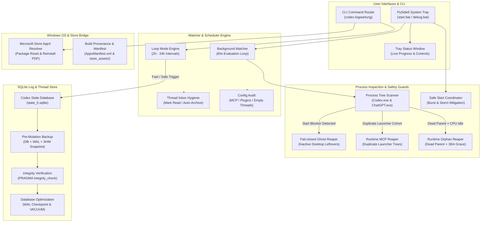
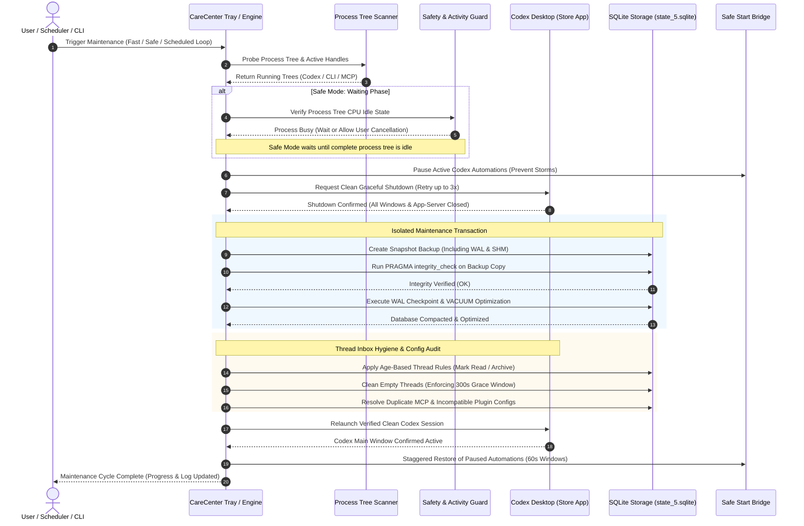

# CareCenter for Codex

> Unofficial Windows tray & CLI utility that keeps the OpenAI Codex desktop app healthy — repairs failed starts, removes hung leftovers, and safely maintains the local SQLite log database. Fully offline, no telemetry.

[](https://github.com/dev-bricks/CareCenter-for-Codex/actions/workflows/tests.yml)
[](https://github.com/dev-bricks/CareCenter-for-Codex)
[](https://github.com/dev-bricks/CareCenter-for-Codex/releases)
[](https://www.python.org/)
[](https://github.com/dev-bricks/CareCenter-for-Codex)
[](SECURITY.md)
[](SECURITY.md)
[](SECURITY.md)
[](https://github.com/astral-sh/ruff)
[](LICENSE)
[](NOTICE)
[](THIRD_PARTY_LICENSES.md)
[](https://pypi.org/project/PySide6/)
[](https://github.com/dev-bricks)
[](https://github.com/open-bricks)
[](llms.txt)
[](CHANGELOG.md)

[English](README.md) · [Deutsch](README.de.md)

> [!NOTE]
> Machine-readable architecture, CLI entry points, and safety rules are indexed for AI agents in [llms.txt](llms.txt).

Local audit notes such as `BEFUNDE.md` and temporary `TASKPLAN*.md` status files are intentionally kept out of Git and are not part of the public release contract.

> [!IMPORTANT]
> This is an independent community tool. It is not created by, affiliated with, endorsed by, or sponsored by OpenAI. "OpenAI" and "Codex" are trademarks of OpenAI and are used here only to describe compatibility.

---

### 🧭 Quick Navigation

- [1. Why & Problem Statement](#why--problem-statement)
- [2. Architecture & System Flow](#architecture--system-flow)
- [3. Complete Lifecycle Sequence](#complete-lifecycle-sequence)
- [4. Key Capabilities & Safety Invariants](#key-capabilities--safety-invariants)
- [5. Target Personas & Discoverability](#target-personas--discoverability)
- [6. Comparative Matrix & Alternatives](#comparative-matrix--alternatives)
- [7. Sibling Ecosystem & Partner Tools](#sibling-ecosystem--partner-tools)
- [8. Features](#features)
- [9. Screenshot](#screenshot)
- [10. Requirements](#requirements)
- [11. Install and Run](#install-and-run)
- [12. CLI Usage](#cli-usage)
- [13. Configuration](#configuration)
- [14. Safety Model & Invariants](#safety-model--invariants)
- [15. Windows Store Materials](#windows-store-materials)
- [16. Third-Party Licenses & Transparency](#third-party-licenses--transparency)
- [17. Development & License](#development--license)
- [18. Statutory Notice (§ 521 BGB) & Liability Disclaimer](#statutory-notice--521-bgb--liability-disclaimer)

---

<a id="sec-01"></a><a id="why--problem-statement"></a><a id="warum--problemstellung"></a>
## Why & Problem Statement

On Windows, closing the Codex desktop window can leave a hung main process behind. That leftover process can hold the app singleton lock, so the next start appears to do nothing. CareCenter removes that first blocker safely: it only touches inactive ghost processes, stale lock files, and explicitly requested maintenance paths.

<a id="sec-02"></a><a id="architecture--system-flow"></a><a id="architektur--systemfluss"></a>
## Architecture & System Flow



<a id="sec-03"></a><a id="complete-lifecycle-sequence"></a><a id="vollstaendiger-lebenszyklus-ablauf"></a><a id="vollständiger-lebenszyklus-ablauf"></a>
## Complete Lifecycle Sequence



<a id="sec-04"></a><a id="key-capabilities--safety-invariants"></a><a id="kernfaehigkeiten--sicherheitsinvarianten"></a><a id="kernfähigkeiten--sicherheitsinvarianten"></a>
## Key Capabilities & Safety Invariants

| Invariant / Capability | Architectural Guarantee | Enforcement Mechanism | Safety Boundary |
|---|---|---|---|
| **1. INV-LOCAL-01 (100% Local-First)** | Zero external telemetry, no background data transmission, no cloud sync reliance | Fully offline runtime loop; all paths reside on local filesystem | Network egress strictly prohibited; opt-in manual check (`--live-pages`) isolated |
| **2. INV-NOELEV-02 (Unprivileged User-Mode)** | Normal execution runs in user space without administrator elevation | Standard non-elevated user permissions for watcher, tray, and DB tasks | Elevated repair actions (Store AppX register/reset) require explicit user confirmation |
| **3. INV-ISOLAT-03 (Fail-Closed Process Protection)** | Active processes and productive work are never terminated | Multi-point CPU delta sampling and parent-PID tree inspection | Any detected CPU advancement or missing criteria immediately aborts kill |
| **4. INV-SESSIM-04 (CLI Session Immunity)** | Node-based Codex CLI and detached `codex exec` sessions are protected | Explicit CLI filter and rollout timestamp checks | Active CLI execution acts as global mutation lock for thread store |
| **5. INV-ATOMIC-05 (Pre-Mutation DB Snapshot)** | SQLite database is never mutated in-place without verified backup | Complete snapshot of database file plus WAL and SHM journal files | Any backup failure immediately halts maintenance before VACUUM |
| **6. INV-CRYPTO-06 (Cryptographic Integrity Gate)** | Database corruption is detected before applying maintenance | Execution of `PRAGMA integrity_check` on the backup copy | Non-zero or corrupted check blocks all downstream write/checkpoint operations |
| **7. INV-GRACE-07 (Mandatory Safety Grace Windows)** | New processes and empty threads are given time to complete initialization | 30-minute hard floor for runtime orphans; 300s floor for empty threads | Temporary initialization spikes are never mistaken for dead leftovers |
| **8. INV-STAGGER-08 (Staggered Automation Unpausing)** | Recovery does not flood Codex with simultaneous automation starts | Configurable stagger delay (default: 60s windows) via Safe Start coordinator | Avoids API rate-limit spikes and host CPU saturation |
| **9. INV-NONDEST-09 (Non-Destructive AppX Resolution)** | Microsoft Store package troubleshooting preserves user data | Bounded escalation: no-admin cleanup -> admin suggestion -> Store reinstall PDP | Automatic destructive resets or package purges are strictly forbidden |
| **10. INV-SLA-10 (Strict Verification Parity)** | 100% green test suite, clean linters, and synchronized contracts | Automated CI matrix, Pytest suite (391+ passed), Ruff, and compileall | Code changes require complete verification before release deployment |

<a id="sec-05"></a><a id="target-personas--discoverability"></a><a id="zielgruppen--auffindbarkeit"></a>
## Target Personas & Discoverability

CareCenter for Codex is architected for four primary user groups across the Windows desktop development ecosystem:

| Persona | Profile & Intent | Primary Pain Point | CareCenter Solution & High-Intent Workflows |
|---|---|---|---|
| **1. Solo Developers & AI Engineers** | Power users executing iterative coding turns via OpenAI Codex Desktop on Windows 10/11. | App fails to launch silently after window close due to dangling singleton socket locks or ghost background processes. | One-click tray repair, automatic ghost process cleanup (`Codex.exe` / `ChatGPT.exe`), and safe-start relaunch without losing workspace state. |
| **2. DevOps & Workstation Tooling Integrators** | Engineers automating developer environments, CI runners, and workstation maintenance scripts. | Manual task killing disrupts active CLI sessions; administrative elevation prompts break automated background loops. | Unprivileged user-mode CLI (`codex-logwartung`), fail-closed CLI protection (`INV-SESSIM-04`), and headless loop daemon. |
| **3. Local-First & Data Privacy Advocates** | Security-focused developers demanding complete data ownership and local execution boundaries. | Third-party PC cleaner utilities bundled with telemetry, invasive drivers, and opaque cloud sync dependencies. | Strict zero-egress architecture (`INV-LOCAL-01`), no network calls, fully transparent SQLite VACUUM and WAL checkpoints. |
| **4. IT Support & System Administrators** | Enterprise IT staff supporting fleets of Windows engineering workstations running Store apps. | Corrupted Store AppX package states, bloated thread stores (`state_5.sqlite`), and unmanaged orphan processes. | Bounded Store repair escalation, pre-mutation database snapshots (`INV-ATOMIC-05`), and audit-ready startup receipts. |

#### High-Intent Search & Discovery Keywords
- **English:** `openai codex repair windows`, `codex desktop failed to start`, `codex singleton lock cleanup`, `kill hung codex process`, `codex sqlite vacuum maintenance`, `pyside6 tray developer tools`, `codex desktop background reaper`, `local-first zero-telemetry tray`
- **German:** `OpenAI Codex Reparatur Windows`, `Codex Desktop startet nicht`, `Codex Singleton Lock bereinigen`, `hängende Codex Prozesse beenden`, `Codex SQLite Datenbank Wartung`, `PySide6 System Tray Werkzeug`, `Codex Hintergrundprozess Wächter`, `Lokal-Erstmals Desktop Werkzeug`

<a id="sec-06"></a><a id="comparative-matrix--alternatives"></a><a id="vergleichsmatrix--alternativen"></a>
## Comparative Matrix & Alternatives

The following matrix compares CareCenter for Codex against alternative operational patterns across 10 architectural and functional dimensions:

| Capability & Dimension | CareCenter for Codex | Windows Task Manager | Ad-Hoc Scripts (Batch/PS) | Generic Cleaners (CCleaner) | Codex Reinstallation |
|---|---|---|---|---|---|
| **1. 100% Local-First & Zero Egress** | **Full Guarantee** (`INV-LOCAL-01`, no telemetry) | Offline tool, no network | Script dependent, usually local | ❌ Bundled telemetry & cloud calls | Cloud download required |
| **2. Non-Elevation (`RunAsInvoker`)** | **User Space Only** (`INV-NOELEV-02`, no UAC) | ⚠️ Often requires admin for Store apps | ⚠️ Requires UAC for elevated kills | ❌ Requires full Administrator/UAC | ❌ Requires admin / Store privileges |
| **3. Inactive Ghost & Zombie Reaping** | **Selective & Protected** (`INV-ISOLAT-03`) | ❌ Indiscriminate manual termination | ❌ Blind `taskkill /F` kills active work | ❌ Ignores process lock states | ❌ Process must terminate first |
| **4. CLI & Agent Session Immunity** | **Guaranteed** (`INV-SESSIM-04`, CLI shielded) | ❌ Kills child processes blindly | ❌ Kills all matching process names | ❌ Unaware of CLI/node child trees | ❌ Interrupts all active runs |
| **5. Atomic SQLite DB Maintenance** | **Full Backup + WAL Integrity** (`INV-ATOMIC-05`) | ❌ No database awareness | ❌ Complex / error-prone scripting | ❌ Blind file deletion (data loss) | ❌ Deletes or resets state database |
| **6. Cryptographic Integrity Gate** | **PRAGMA integrity_check** (`INV-CRYPTO-06`) | ❌ None | ❌ None | ❌ None | ❌ None |
| **7. Safe-Start Fallback & Launch Gating** | **Integrated** (`safe-start-for-codex`) | ❌ None | ❌ None | ❌ None | ❌ None |
| **8. Asynchronous PySide6 Tray UI** | **Responsive QThread Architecture** | Basic Task Manager UI | ❌ Headless / CLI only | Heavy proprietary UI | Windows Store UI |
| **9. MS Store AppX Resolution Path** | **Bounded Escalation & Diagnostics** | Terminate / Reset only | Manual PowerShell AppX commands | ❌ Unsupported | Full manual Store reinstall |
| **10. Security SLA & Contract Tests** | **48h SLA & 391+ Pytest Suite** | N/A | ❌ No test harness | ❌ Proprietary closed-source | Closed-source binary |

<a id="sec-07"></a><a id="sibling-ecosystem--partner-tools"></a><a id="geschwisterwerkzeuge--partner-oekosystem"></a><a id="geschwisterwerkzeuge--partner-ökosystem"></a>
## Sibling Ecosystem & Partner Tools

| Partner Tool | Organization | Role & Capability | Integration with CareCenter |
|---|---|---|---|
| **[safe-start-for-codex](https://github.com/dev-bricks/safe-start-for-codex)** | dev-bricks | Process startup gating, burst protection, and automation pauses | Core dependency; bundled and invoked for launch storms and automation management |
| **[MethodenAnalyser](https://github.com/dev-bricks/MethodenAnalyser)** | dev-bricks | Static AST analysis, class/method extraction, and cyclomatic complexity | Validates code health, refactoring scopes, and Python codebase architecture |
| **[companion-for-agy](https://github.com/ellmos-ai/companion-for-agy)** | ellmos-ai | Windows ConPTY bridge, pseudo-terminal daemon, and session supervisor | Shares process-isolation invariants and protects agent background executions |
| **[lock-master](https://github.com/dev-bricks/lock-master)** | dev-bricks | Multi-agent concurrency control, lock caches, and file reservation | Enforces zero-collision file access across autonomous coding agents |
| **[bach](https://github.com/ellmos-ai/bach)** | ellmos-ai | Brain Architecture Orchestrator and task decomposition runtime | Coordinates multi-agent workflows and high-level autonomous task distribution |
| **[usmc](https://github.com/ellmos-ai/usmc)** | ellmos-ai | Unified System Mission Control and desktop operations dashboard | Aggregates health metrics, service statuses, and operational alerts across tools |
| **[clutch](https://github.com/ellmos-ai/clutch)** | ellmos-ai | Tool hook manager, git hooks, and semantic execution dispatching | Manages developer environment hooks and pre-commit governance validation |
| **[open-compute](https://github.com/ellmos-ai/open-compute)** | ellmos-ai | Autonomous computer-use agent and cross-platform OS task executor | Leverages clean process environments ensured by CareCenter's ghost reapers |
| **[system-auditor](https://github.com/ellmos-ai/system-auditor)** | ellmos-ai | Multi-host diagnostic engine, environment drift and gap detector | Monitors host-wide registry state, disk hygiene, and process integrity |
| **[CloudLockFixer](https://github.com/file-bricks/CloudLockFixer)** | file-bricks | Cloud synchronization unlocker and conflict copy manager | Unlocks stuck cloud synchronization files without corrupting local data |
| **[SoftwareCenter](https://github.com/file-bricks/SoftwareCenter)** | file-bricks | Central PySide6 software catalog and desktop application dashboard | Lists and manages desktop utilities including CareCenter and companion tools |
| **[DokuZen](https://github.com/doc-bricks/DokuZen)** | doc-bricks | Document processing, OCR, automated redaction, and PDF cleanup | Complements local-first desktop workflows with zero-network document security |

<a id="sec-08"></a><a id="features"></a><a id="funktionen"></a>
## Features

- Background watcher: checks every 60 seconds for old start blockers, detached runtime orphans, and duplicate runtime MCP process generations. Runtime-orphan cleanup requires a dead parent, a hard 30-minute grace period, and two CPU snapshots. Detached `codex exec` runs remain protected while CPU advances, a session rollout is newer than two minutes, or their `--output-last-message` target is still missing; inactive `language_server*` orphans remain eligible. Every successful orphan kill records PID, command line, and criterion in `app.log`. Runtime MCP cleanup still targets only idle launcher trees repeated under the same Store desktop app-server and always keeps the newest launch cohort.
- Tray settings with language switching: choose English or German in the Settings area. The choice is saved in `config.json` and the visible tray UI is relabeled immediately.
- Tray automation controls: pause all currently active Codex automations, restore only automations disabled by CCC, or turn automations back on immediately or gradually. The spacing is configurable via `automation_stagger_delay_seconds` (default: 60 seconds).
- Thread inbox hygiene: mark every result as read, mark only unread threads older than a configurable number of days, and automatically archive threads older than a separate configurable age. Empty-thread auto-fix waits at least 300 seconds so new CLI/Desktop threads can finish their first write. Current Codex thread ages and archive flags come from `state_5.sqlite`; unread IDs come from `.codex-global-state.json`. Changes are blocked by either Desktop or npm Codex CLI activity, rechecked immediately before backup/move, and use database/state backups, atomic JSON writes, and transactional archive updates.
- Config audit cleanup has three independent `off` / `notify` / `auto` controls for duplicate MCP configuration entries, Windows-incompatible plugins, and empty threads. The manual audit additionally runs the conservative runtime MCP reaper even while the desktop renderer is present; configuration and thread mutations remain deferred until Codex is closed.
- Loop mode: choose 2, 3, 5, 7, 10, 12, or 24 hours. Each regular due cycle starts with Fast maintenance and retries Codex close failures up to three times by default. If closing still fails, Safe becomes an extended catch-up attempt and the normal loop timer starts over; if Safe finishes before that timer expires, the timer starts again from the successful maintenance plus verified Codex restart. If the timer expires while Safe is still waiting, Safe is cancelled and the next regular Fast cycle starts. Automations are paused only after maintenance has succeeded, and only those paused automations are restored in 60-second windows.
- Direct tray starts: "Codex safe starten" launches Safe Start for Codex in its own tray and reuses its `config.json`; if that config is missing, CareCenter uses a 1-minute interval for that launch. If Safe Start is already gating, the second safe-start click is a no-op. "Codex starten" starts Codex normally without the Safe Start gate; while Safe Start is active, CareCenter only restores the automations paused by Safe Start and does not open another Codex window.
- One-click Repair Codex action: runs a bounded escalation that stops as soon as Codex starts again. It begins with no-admin cleanup and only suggests admin restart, Store reinstall, or reboot when needed.
- Current Store-process compatibility: recognizes both legacy `Codex.exe` Electron trees and newer `ChatGPT.exe`-named Codex Store trees, including their embedded app-server, without confusing CareCenter itself with Codex.
- Safe and Fast maintenance modes:
  - Safe waits until the complete Codex process tree is idle, can be cancelled while waiting, closes Codex cleanly, runs maintenance, and restarts it.
  - Fast closes Codex immediately and then runs maintenance.
- Store tools: repair a stuck Microsoft Store update path and open the Store reinstall page for Codex.
- Conservative database maintenance: backup including WAL/SHM, integrity check on the backup, WAL checkpoint, `PRAGMA optimize`, `VACUUM`, and limited backup retention.
- Status window with progress bar, live tray tooltip, and persistent audit logs.
- Safe Start for Codex is shipped as a dependency and can be installed or updated from the CareCenter window, tray, or CLI. CareCenter uses it for release bursts, start storms, and catch-up hints.

<a id="sec-09"></a><a id="screenshot"></a><a id="bildschirmfoto"></a>
## Screenshot

The tray status window shows current state, removed-leftover count, progress, maintenance controls with Safe cancellation, Loop mode, Store actions, Safe Start actions, automation controls, and settings.


Regenerate the screenshot from the real PySide6 status window:

```powershell
$env:PYTHONPATH="src"
python -m codex_logdatenbank_wartung.cli store-screenshot
```

<a id="sec-10"></a><a id="requirements"></a><a id="voraussetzungen"></a>
## Requirements

- Windows 10 or Windows 11
- Python 3.12+ when running from source
- [PySide6](https://pypi.org/project/PySide6/) for the tray UI

Packaged EXE builds do not require a separate Python installation.

<a id="sec-11"></a><a id="install-and-run"></a><a id="installation-und-start"></a>
## Install and Run

From source:

```powershell
$env:PYTHONPATH="$PWD\src"
pip install -r requirements.txt
python -m codex_logdatenbank_wartung.cli status
python -m codex_logdatenbank_wartung.cli tray
```

For the normal tray start from a checkout, use `start.bat`. It launches the tray
windowlessly through `pythonw.exe` and writes startup failures to
`%LOCALAPPDATA%\CareCenterForCodex\logs\app.log`. Use `debug.bat` when you want
the console to stay visible for troubleshooting.

Build a standalone EXE:

```powershell
build_exe.bat
```

For a controlled non-production build, override both local output roots:

```powershell
$env:CARECENTER_DIST_DIR = "C:\_Local_DEV\codex_build\artifacts\carecenter"
$env:CARECENTER_BUILD_ROOT = "C:\_Local_DEV\codex_build\work\carecenter"
build_exe.bat
```

The build refuses tracked uncommitted source changes. It embeds the project version,
Git commit, and UTC build time in the EXE and writes
`CareCenterForCodex.provenance.json` next to it with the artifact size and SHA-256.
`status`, `doctor`, and the tray startup log report the embedded build identity.

By default, the build uses the public Safe Start GitHub source pinned to an exact
commit in `pyproject.toml`. This keeps the build reproducible without silently
bundling a dirty local sibling checkout. Only use a local Safe Start source on
purpose:

```powershell
$env:CARECENTER_SAFE_START_SOURCE = "C:\path\to\REL-PUB_safe-start-for-codex"
build_exe.bat
```

The same pattern applies to the optional [zombie-killer-tray](https://github.com/dev-bricks/zombie-killer-tray) integration (conservative cleanup of orphaned MCP and language-server processes, launched as its own subprocess via `zombie-killer-watch`): pinned to an exact commit by default, overridable for a local sibling checkout via `$env:CARECENTER_ZOMBIE_KILLER_SOURCE`.

<a id="sec-12"></a><a id="cli-usage"></a><a id="cli-befehle"></a>
## CLI Usage

```powershell
python -m codex_logdatenbank_wartung.cli doctor
python -m codex_logdatenbank_wartung.cli repair --dry-run
python -m codex_logdatenbank_wartung.cli repair --execute
python -m codex_logdatenbank_wartung.cli dry-run
python -m codex_logdatenbank_wartung.cli maintain --execute
python -m codex_logdatenbank_wartung.cli auto-maintain --mode safe --execute
python -m codex_logdatenbank_wartung.cli fast-loop-cycle --execute
python -m codex_logdatenbank_wartung.cli mark-runs-read --dry-run
python -m codex_logdatenbank_wartung.cli mark-runs-read --older-than-days 2
python -m codex_logdatenbank_wartung.cli mark-runs-read --older-than-days 2 --archive-older-than-days 10
python -m codex_logdatenbank_wartung.cli startup-receipt C:\path\rollout.jsonl --boot-file GPT=C:\path\GPT.md --format json
python -m codex_logdatenbank_wartung.cli store-repair --level repair --execute
python -m codex_logdatenbank_wartung.cli store-materials
python -m codex_logdatenbank_wartung.cli safe-start-report
python -m codex_logdatenbank_wartung.cli safe-start-install
python -m codex_logdatenbank_wartung.cli zombie-killer-report
python -m codex_logdatenbank_wartung.cli zombie-killer-install
python -m codex_logdatenbank_wartung.cli zombie-killer-watch
python -m codex_logdatenbank_wartung.cli schedule install --interval-minutes 180
```

The CLI reads `language` from `config.json` for runtime reports. The tray settings are the intended way to switch the persisted language.

`startup-receipt` reads only through the first assistant boundary of the explicitly
named rollout. It emits metadata, character/byte counts, and SHA-256 values—not
prompt content. External `--boot-file LABEL=PATH` inputs are reported as
`injection_claim=false` snapshots and never presented as proof that Codex injected them.

In the tray settings, `0` disables an age rule. Set `auto_mark_threads_read_days` and
`auto_archive_threads_days` to independent values such as `2` and `10`. CareCenter applies
the rules during background watcher ticks as soon as Codex is fully closed.

<a id="sec-13"></a><a id="configuration"></a><a id="konfiguration"></a>
## Configuration

Configuration, logs, and backups live outside cloud-synced folders by default:

```text
config:   %LOCALAPPDATA%\CareCenterForCodex\config.json
logs:     %LOCALAPPDATA%\CareCenterForCodex\logs\
backups:  %LOCALAPPDATA%\CareCenterForCodex\backups\
database: %USERPROFILE%\.codex\logs_2.sqlite
```

Codex paths are detected from `%LOCALAPPDATA%`, `%APPDATA%`, and `CODEX_HOME`. New installs also place CareCenter data under `%LOCALAPPDATA%\CareCenterForCodex` by default. Existing local setups under `C:\_Local_DEV\codex-maintenance\` are reused automatically as a legacy fallback. You can override every path in `config.json`.

Runtime MCP cleanup is enabled by default through `reap_runtime_mcp_duplicates`.
Its conservative defaults are a configurable 3600-second (one-hour) minimum age for
every candidate root, a 90-second launch-cohort
gap, a 30-second launcher window, at least two distinct repeated MCP signatures,
and a 1-second CPU activity sample. Each threshold can be overridden in `config.json`.

Runtime-orphan cleanup keeps the compatible `reap_companion_orphans` configuration
prefix. `companion_orphan_min_age_seconds` has a hard 1800-second safety floor;
the default CPU sample is 5 seconds and the session-rollout freshness window is
120 seconds. Configured CPU windows cannot reduce the two-snapshot interval below
2 seconds, and the rollout window cannot be shortened below 120 seconds.

`audit_empty_thread_min_age_seconds` defaults to 300 seconds. Values below 300
are clamped to that conservative initialization grace; larger values extend it.

To use a different data root (useful in tests or alternative installations), set `CCC_DATA_ROOT` before launching:

```powershell
$env:CCC_DATA_ROOT = "D:\my-codex-maintenance"
python -m codex_logdatenbank_wartung.cli tray
```

When set, `config.json`, `logs\`, and `backups\` are placed under that path instead of the default `%LOCALAPPDATA%\CareCenterForCodex\`.

<a id="sec-14"></a><a id="safety-model--invariants"></a><a id="sicherheitsmodell--invarianten"></a>
## Safety Model & Invariants

- Normal CareCenter runtime and the default CLI commands are local-only: they do
  not send telemetry, upload data, call external APIs, or use cloud sync.
- Conservative maintenance blocks while Codex is running.
- Scheduled maintenance never closes Codex.
- Safe auto-maintain only closes Codex after the full process tree is idle.
- Safe cancellation stops only the waiting phase before Codex is closed; active database operations are not force-interrupted.
- The watcher kills inactive ghosts without a renderer only after the configured age threshold.
- Duplicate runtime MCP cleanup always keeps the newest launch cohort and skips candidate trees whose CPU counters still advance.
- Runtime-orphan cleanup requires a dead parent plus age and CPU-idle evidence. A detached `codex exec` is additionally excluded while any CPU, recent rollout, or pending-output signal remains; a run without an `--output-last-message` contract is excluded fail-closed. Idle dead-parent `language_server*` processes remain cleanup targets.
- The Codex desktop app-server, unrelated child processes, active Codex CLI work, and active desktop work are excluded from process termination. The broad read-only detector still treats Desktop and npm CLI activity as a blocker for thread-store mutation.
- Destructive paths such as Store reset, admin repair, reinstall, and reboot are suggestions or explicit user actions, not automatic surprises.
- The [CareCenter Health Exchange Contract v1](CARE_CENTER_EXCHANGE_CONTRACT.md)
  defines a privacy-minimized, read-only snapshot for BACH/OCEAN. It adds no
  runtime transport, inbound command, telemetry, or remote maintenance authority.

<a id="sec-15"></a><a id="windows-store-materials"></a><a id="windows-store-materialien"></a>
## Windows Store Materials

The project includes Windows Store groundwork:

- `store_package.json`
- `STORE_LISTING.md`
- `PRIVACY_POLICY.md`
- `SUPPORT.md`
- `docs/privacy.md`
- `docs/support.md`
- `AppxManifest.xml` with four canonical package-logo sources in `store_assets/`

Public Store pages:

- Privacy: `https://dev-bricks.github.io/CareCenter-for-Codex/privacy`
- Support: `https://dev-bricks.github.io/CareCenter-for-Codex/support`

Validate them with:

```powershell
python -m codex_logdatenbank_wartung.cli store-materials
python -m codex_logdatenbank_wartung.cli store-materials --live-pages
python -m codex_logdatenbank_wartung.cli store-materials --exe-path C:\_Local_DEV\codex-maintenance\bin
```

The command without `--live-pages` is a local-only material check and does not
contact either URL. `--live-pages` is a separate, explicit manual release
preflight: only this opt-in path requests both configured Store URLs over HTTPS
and reports unreachable pages as warnings. It is not part of the tray, watcher,
maintenance, or normal CLI runtime and is not telemetry. Without `--exe-path`,
the check tries to discover the built EXE automatically from `build_exe.bat`
(`DIST_DIR`). With `--exe-path`, you can pass either the exact `.exe` file or
just the build directory.

The local preflight parses `AppxManifest.xml`, compares its package identity,
publisher, version, executable, and display name with `store_package.json`, and
maps its staged `icons/` references to the central builder's `store_assets/`
sources. It fails if a source logo is missing or escapes that source directory.

The Store privacy/support URLs are prepared for GitHub Pages. `store-materials` also runs a temporary static Pages build and verifies `privacy/index.html`, `support/index.html`, `index.html`, and the build marker. You can still build the artifact explicitly with:

```powershell
python scripts\build_store_pages.py --output _site
```

The active workflow `.github/workflows/pages.yml` publishes the generated `/privacy/` and `/support/` routes through GitHub Pages.

<a id="sec-16"></a><a id="third-party-licenses--transparency"></a><a id="drittanbieter-lizenzen--transparenz"></a>
## Third-Party Licenses & Transparency

CareCenter for Codex maintains strict license transparency and distribution compliance:

- **Core Application:** Licensed under the permissive [MIT License](LICENSE).
- **GUI Subsystem:** Powered by **PySide6** (`>=6.7`), dynamically linked in full compliance with the **GNU Lesser General Public License v3 (LGPL-3.0-only)**. No Qt6/PySide6 source code is modified or redistributed in proprietary form. Users retain the freedom to relink or replace the installed PySide6 runtime wheels.
- **Configuration Engine:** Built on **tomlkit** under the **MIT License**.
- **Build & Integration Tooling:** Safe Start integration (`safe-start-for-codex`, MIT), zombie-killer-tray integration (`zombie-killer-tray`, MIT), PyInstaller packaging (GPLv2 with PyInstaller Exception), and Hatchling (MIT).
- **Audit & Invariants Document:** A comprehensive audit of all runtime, development, standard library dependencies, and the 10 Governance & Runtime Safety Invariants is maintained in [THIRD_PARTY_LICENSES.md](THIRD_PARTY_LICENSES.md). Legacy text format is preserved in [THIRD_PARTY_LICENSES.txt](THIRD_PARTY_LICENSES.txt).

<a id="sec-17"></a><a id="development--license"></a><a id="entwicklung--lizenz"></a>
## Development & License

### Development

```powershell
$env:PYTHONPATH="src"
python -m pytest
python -m ruff check src tests
python -m compileall src tests
```

The test suite covers maintenance safety, repair escalation, Safe Start integration, automation control, Store material validation, configuration loading, i18n, and tray language persistence.

### License

CareCenter for Codex is licensed under [MIT](LICENSE). PySide6 is used under the LGPL;
the direct-dependency inventory and its update scope are documented in
[THIRD_PARTY_LICENSES.txt](THIRD_PARTY_LICENSES.txt).

<a id="sec-18"></a><a id="statutory-notice--521-bgb--liability-disclaimer"></a><a id="gesetzlicher-hinweis--521-bgb--haftungsausschluss"></a>
## Statutory Notice (§ 521 BGB) & Liability Disclaimer

### Statutory Liability Limitation (§ 521 BGB - Gefälligkeitsrecht / Gratuitous Performance)
This software and associated automation harnesses are provided free of charge without commercial consideration. In accordance with German statutory law (§ 521 BGB - *Gefälligkeitsrecht*), the liability of the author and contributors is strictly restricted to intent (*Vorsatz*) and gross negligence (*grobe Fahrlässigkeit*). The software is provided "as is", without warranty of any kind, express or implied.

### Security Response SLA
Security vulnerability disclosures are coordinated under [`SECURITY.md`](SECURITY.md), providing a guaranteed 48-hour response acknowledgement and a 5-business-day triage commitment.
